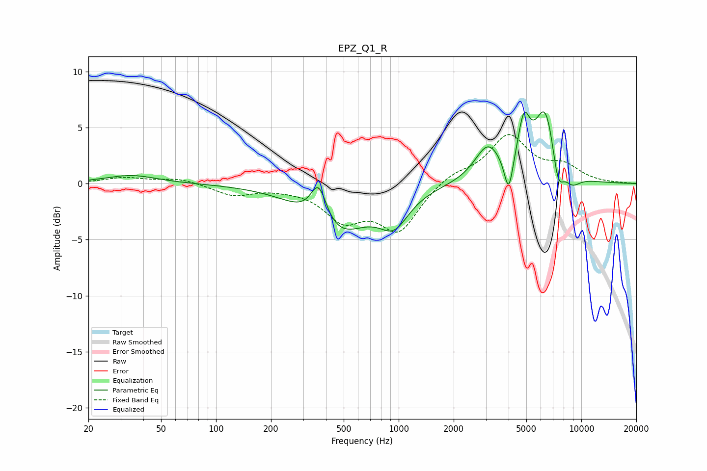

# EPZ_Q1_R
See [usage instructions](https://github.com/jaakkopasanen/AutoEq#usage) for more options and info.

### Parametric EQs
Apply preamp of -6.5 dB when using parametric equalizer.

|   # | Type    |   Fc (Hz) |    Q |   Gain (dB) |
|-----|---------|-----------|------|-------------|
|   1 | Peaking |        34 | 1.03 |         0.7 |
|   2 | Peaking |       365 | 3.15 |         3.6 |
|   3 | Peaking |       458 | 0.85 |        -4.4 |
|   4 | Peaking |       943 | 1.76 |        -2.7 |
|   5 | Peaking |      3077 | 1.98 |         3.2 |
|   6 | Peaking |      4003 | 5.93 |        -3.3 |
|   7 | Peaking |      4846 | 4.26 |         4.1 |
|   8 | Peaking |      6375 | 2.26 |         6.7 |
|   9 | Peaking |      7437 | 4.2  |        -3.2 |
|  10 | Peaking |      8900 | 2.86 |        -1.1 |

### Fixed Band EQs
When using fixed band (also called graphic) equalizer, apply preamp of **-4.5 dB** (if available) and set gains manually with these parameters.

|   # | Type    |   Fc (Hz) |    Q |   Gain (dB) |
|-----|---------|-----------|------|-------------|
|   1 | Peaking |        31 | 1.41 |         0.5 |
|   2 | Peaking |        62 | 1.41 |         0.5 |
|   3 | Peaking |       125 | 1.41 |        -1   |
|   4 | Peaking |       250 | 1.41 |        -0.2 |
|   5 | Peaking |       500 | 1.41 |        -3   |
|   6 | Peaking |      1000 | 1.41 |        -4.1 |
|   7 | Peaking |      2000 | 1.41 |         0.9 |
|   8 | Peaking |      4000 | 1.41 |         4.2 |
|   9 | Peaking |      8000 | 1.41 |         1.4 |
|  10 | Peaking |     16000 | 1.41 |         0   |

### Graphs

