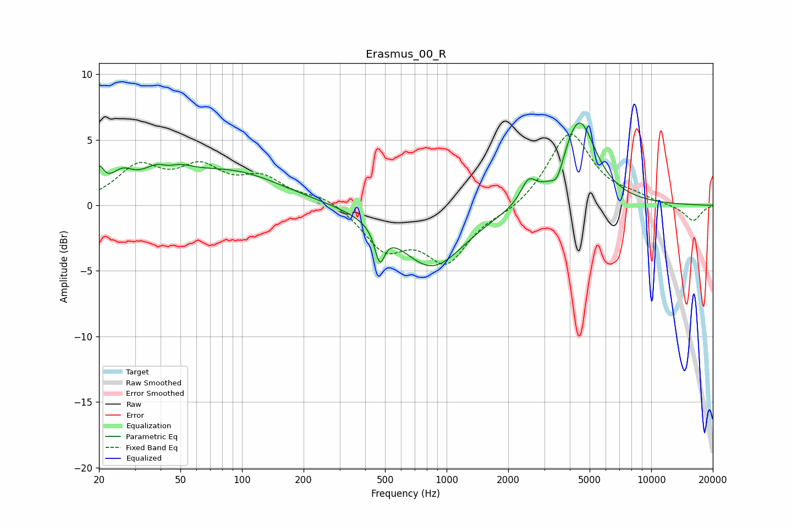

# Erasmus_00_R
See [usage instructions](https://github.com/jaakkopasanen/AutoEq#usage) for more options and info.

### Parametric EQs
Apply preamp of -6.4 dB when using parametric equalizer.

|   # | Type    |   Fc (Hz) |    Q |   Gain (dB) |
|-----|---------|-----------|------|-------------|
|   1 | Peaking |        20 | 5.95 |         1.8 |
|   2 | Peaking |        26 | 2.54 |         1.5 |
|   3 | Peaking |        42 | 1.64 |         3   |
|   4 | Peaking |        43 | 2.8  |        -1.4 |
|   5 | Peaking |        90 | 0.58 |         2.4 |
|   6 | Peaking |       471 | 5.98 |        -2.5 |
|   7 | Peaking |       847 | 0.88 |        -4.7 |
|   8 | Peaking |      2511 | 3.83 |         1.6 |
|   9 | Peaking |      3475 | 4.71 |        -1.3 |
|  10 | Peaking |      4427 | 1.7  |         6.6 |

### Fixed Band EQs
When using fixed band (also called graphic) equalizer, apply preamp of **-5.5 dB** (if available) and set gains manually with these parameters.

|   # | Type    |   Fc (Hz) |    Q |   Gain (dB) |
|-----|---------|-----------|------|-------------|
|   1 | Peaking |        31 | 1.41 |         2.7 |
|   2 | Peaking |        62 | 1.41 |         2.5 |
|   3 | Peaking |       125 | 1.41 |         1.9 |
|   4 | Peaking |       250 | 1.41 |         0.7 |
|   5 | Peaking |       500 | 1.41 |        -3.1 |
|   6 | Peaking |      1000 | 1.41 |        -4   |
|   7 | Peaking |      2000 | 1.41 |        -0.5 |
|   8 | Peaking |      4000 | 1.41 |         5.6 |
|   9 | Peaking |      8000 | 1.41 |         0.5 |
|  10 | Peaking |     16000 | 1.41 |        -1.2 |

### Graphs

