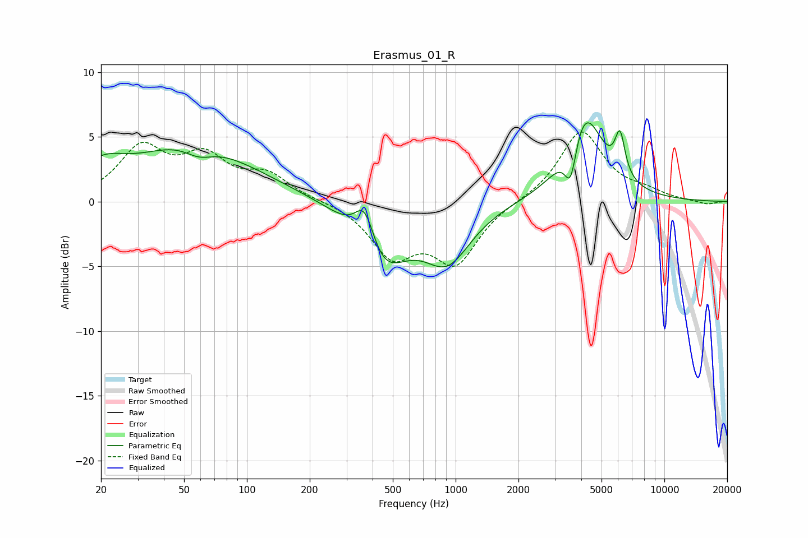

# Erasmus_01_R
See [usage instructions](https://github.com/jaakkopasanen/AutoEq#usage) for more options and info.

### Parametric EQs
Apply preamp of -6.2 dB when using parametric equalizer.

|   # | Type    |   Fc (Hz) |    Q |   Gain (dB) |
|-----|---------|-----------|------|-------------|
|   1 | Peaking |        20 | 1.24 |         2   |
|   2 | Peaking |        52 | 0.58 |         3.1 |
|   3 | Peaking |        59 | 1.98 |        -1   |
|   4 | Peaking |        73 | 0.42 |         1.4 |
|   5 | Peaking |       368 | 2.82 |         3.7 |
|   6 | Peaking |       435 | 1.17 |        -5.3 |
|   7 | Peaking |       914 | 1.24 |        -4.1 |
|   8 | Peaking |      3558 | 4.86 |        -3.4 |
|   9 | Peaking |      4120 | 1.55 |         7   |
|  10 | Peaking |      6133 | 5.88 |         3.2 |

### Fixed Band EQs
When using fixed band (also called graphic) equalizer, apply preamp of **-5.5 dB** (if available) and set gains manually with these parameters.

|   # | Type    |   Fc (Hz) |    Q |   Gain (dB) |
|-----|---------|-----------|------|-------------|
|   1 | Peaking |        31 | 1.41 |         3.9 |
|   2 | Peaking |        62 | 1.41 |         3   |
|   3 | Peaking |       125 | 1.41 |         1.9 |
|   4 | Peaking |       250 | 1.41 |         0.1 |
|   5 | Peaking |       500 | 1.41 |        -3.9 |
|   6 | Peaking |      1000 | 1.41 |        -4.5 |
|   7 | Peaking |      2000 | 1.41 |         0   |
|   8 | Peaking |      4000 | 1.41 |         5.5 |
|   9 | Peaking |      8000 | 1.41 |         0.6 |
|  10 | Peaking |     16000 | 1.41 |        -0.3 |

### Graphs

