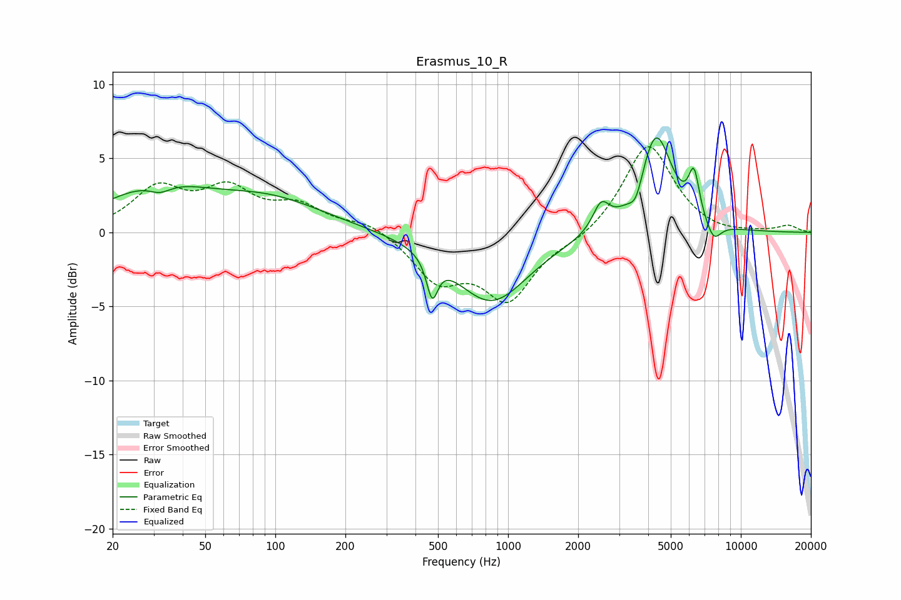

# Erasmus_10_R
See [usage instructions](https://github.com/jaakkopasanen/AutoEq#usage) for more options and info.

### Parametric EQs
Apply preamp of -6.5 dB when using parametric equalizer.

|   # | Type    |   Fc (Hz) |    Q |   Gain (dB) |
|-----|---------|-----------|------|-------------|
|   1 | Peaking |        30 | 0.66 |         2.8 |
|   2 | Peaking |        32 | 2.88 |        -0.7 |
|   3 | Peaking |        95 | 0.58 |         2   |
|   4 | Peaking |       472 | 5.98 |        -2.6 |
|   5 | Peaking |       847 | 0.9  |        -4.7 |
|   6 | Peaking |      2510 | 3.98 |         1.8 |
|   7 | Peaking |      3549 | 4.82 |        -1.4 |
|   8 | Peaking |      4311 | 2    |         6.7 |
|   9 | Peaking |      6291 | 5.98 |         3   |
|  10 | Peaking |      7627 | 4.09 |        -1.3 |

### Fixed Band EQs
When using fixed band (also called graphic) equalizer, apply preamp of **-5.9 dB** (if available) and set gains manually with these parameters.

|   # | Type    |   Fc (Hz) |    Q |   Gain (dB) |
|-----|---------|-----------|------|-------------|
|   1 | Peaking |        31 | 1.41 |         2.8 |
|   2 | Peaking |        62 | 1.41 |         2.6 |
|   3 | Peaking |       125 | 1.41 |         1.6 |
|   4 | Peaking |       250 | 1.41 |         0.8 |
|   5 | Peaking |       500 | 1.41 |        -3   |
|   6 | Peaking |      1000 | 1.41 |        -4.3 |
|   7 | Peaking |      2000 | 1.41 |        -0.5 |
|   8 | Peaking |      4000 | 1.41 |         6.1 |
|   9 | Peaking |      8000 | 1.41 |        -0.2 |
|  10 | Peaking |     16000 | 1.41 |         0.4 |

### Graphs

