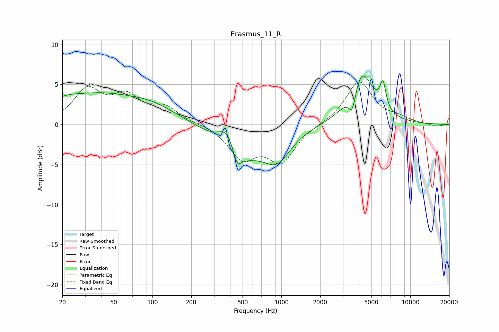

# Erasmus_11_R
See [usage instructions](https://github.com/jaakkopasanen/AutoEq#usage) for more options and info.

### Parametric EQs
Apply preamp of -6.2 dB when using parametric equalizer.

|   # | Type    |   Fc (Hz) |    Q |   Gain (dB) |
|-----|---------|-----------|------|-------------|
|   1 | Peaking |        20 | 1.02 |         1.7 |
|   2 | Peaking |        39 | 0.59 |         2.7 |
|   3 | Peaking |        96 | 0.64 |         2.1 |
|   4 | Peaking |       384 | 1.96 |         3.7 |
|   5 | Peaking |       452 | 4.26 |        -2.1 |
|   6 | Peaking |       453 | 0.89 |        -4.8 |
|   7 | Peaking |       926 | 1.32 |        -3.7 |
|   8 | Peaking |      3556 | 4.77 |        -3.1 |
|   9 | Peaking |      4166 | 1.55 |         6.8 |
|  10 | Peaking |      6138 | 6    |         3.2 |

### Fixed Band EQs
When using fixed band (also called graphic) equalizer, apply preamp of **-5.4 dB** (if available) and set gains manually with these parameters.

|   # | Type    |   Fc (Hz) |    Q |   Gain (dB) |
|-----|---------|-----------|------|-------------|
|   1 | Peaking |        31 | 1.41 |         4.1 |
|   2 | Peaking |        62 | 1.41 |         3.1 |
|   3 | Peaking |       125 | 1.41 |         1.9 |
|   4 | Peaking |       250 | 1.41 |         0.1 |
|   5 | Peaking |       500 | 1.41 |        -4   |
|   6 | Peaking |      1000 | 1.41 |        -4.4 |
|   7 | Peaking |      2000 | 1.41 |         0   |
|   8 | Peaking |      4000 | 1.41 |         5.4 |
|   9 | Peaking |      8000 | 1.41 |         0.6 |
|  10 | Peaking |     16000 | 1.41 |        -0.3 |

### Graphs

