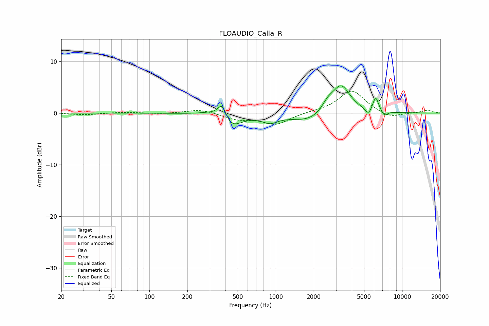

# FLOAUDIO_Calla_R
See [usage instructions](https://github.com/jaakkopasanen/AutoEq#usage) for more options and info.

### Parametric EQs
Apply preamp of -5.4 dB when using parametric equalizer.

|   # | Type    |   Fc (Hz) |    Q |   Gain (dB) |
|-----|---------|-----------|------|-------------|
|   1 | Peaking |       306 | 1.69 |         0.7 |
|   2 | Peaking |       376 | 3.9  |         3.5 |
|   3 | Peaking |       431 | 1.7  |        -3.2 |
|   4 | Peaking |       898 | 2.22 |        -1.4 |
|   5 | Peaking |      1904 | 0.96 |        -1.9 |
|   6 | Peaking |      2569 | 3.02 |         1.6 |
|   7 | Peaking |      3285 | 1.9  |         5.7 |
|   8 | Peaking |      5415 | 6    |        -1.3 |
|   9 | Peaking |      6181 | 6    |         2.8 |
|  10 | Peaking |      7260 | 5.97 |        -1   |

### Fixed Band EQs
When using fixed band (also called graphic) equalizer, apply preamp of **-4.3 dB** (if available) and set gains manually with these parameters.

|   # | Type    |   Fc (Hz) |    Q |   Gain (dB) |
|-----|---------|-----------|------|-------------|
|   1 | Peaking |        31 | 1.41 |        -0.3 |
|   2 | Peaking |        62 | 1.41 |         0.2 |
|   3 | Peaking |       125 | 1.41 |        -0.1 |
|   4 | Peaking |       250 | 1.41 |         0.8 |
|   5 | Peaking |       500 | 1.41 |        -1.1 |
|   6 | Peaking |      1000 | 1.41 |        -2.2 |
|   7 | Peaking |      2000 | 1.41 |         0.2 |
|   8 | Peaking |      4000 | 1.41 |         4.4 |
|   9 | Peaking |      8000 | 1.41 |        -1.1 |
|  10 | Peaking |     16000 | 1.41 |         0.6 |

### Graphs

