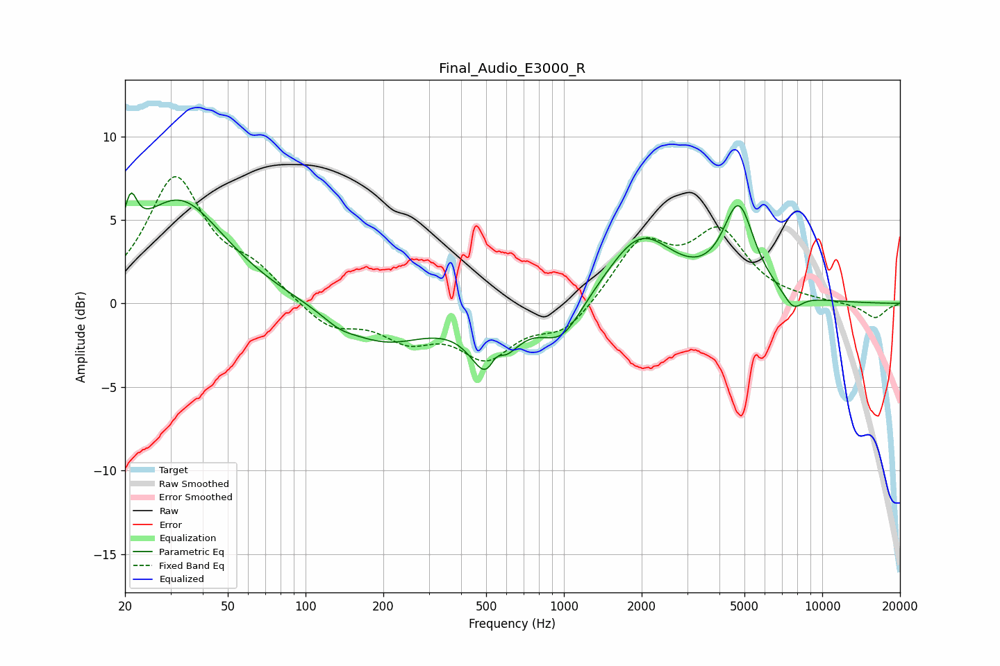

# Final_Audio_E3000_R
See [usage instructions](https://github.com/jaakkopasanen/AutoEq#usage) for more options and info.

### Parametric EQs
Apply preamp of -6.7 dB when using parametric equalizer.

|   # | Type    |   Fc (Hz) |    Q |   Gain (dB) |
|-----|---------|-----------|------|-------------|
|   1 | Peaking |        21 | 5.64 |         2.6 |
|   2 | Peaking |        32 | 0.8  |         6.2 |
|   3 | Peaking |       135 | 2.31 |        -0.5 |
|   4 | Peaking |       201 | 0.81 |        -2.3 |
|   5 | Peaking |       528 | 2.14 |        -4.9 |
|   6 | Peaking |       545 | 4.36 |         2.1 |
|   7 | Peaking |       980 | 1.73 |        -2.3 |
|   8 | Peaking |      1983 | 1.09 |         4   |
|   9 | Peaking |      4746 | 2.3  |         5.3 |
|  10 | Peaking |      7717 | 3.61 |        -1   |

### Fixed Band EQs
When using fixed band (also called graphic) equalizer, apply preamp of **-7.7 dB** (if available) and set gains manually with these parameters.

|   # | Type    |   Fc (Hz) |    Q |   Gain (dB) |
|-----|---------|-----------|------|-------------|
|   1 | Peaking |        31 | 1.41 |         7.4 |
|   2 | Peaking |        62 | 1.41 |         1.6 |
|   3 | Peaking |       125 | 1.41 |        -1.5 |
|   4 | Peaking |       250 | 1.41 |        -1.8 |
|   5 | Peaking |       500 | 1.41 |        -2.9 |
|   6 | Peaking |      1000 | 1.41 |        -1.7 |
|   7 | Peaking |      2000 | 1.41 |         3.6 |
|   8 | Peaking |      4000 | 1.41 |         4   |
|   9 | Peaking |      8000 | 1.41 |         0.1 |
|  10 | Peaking |     16000 | 1.41 |        -0.9 |

### Graphs

