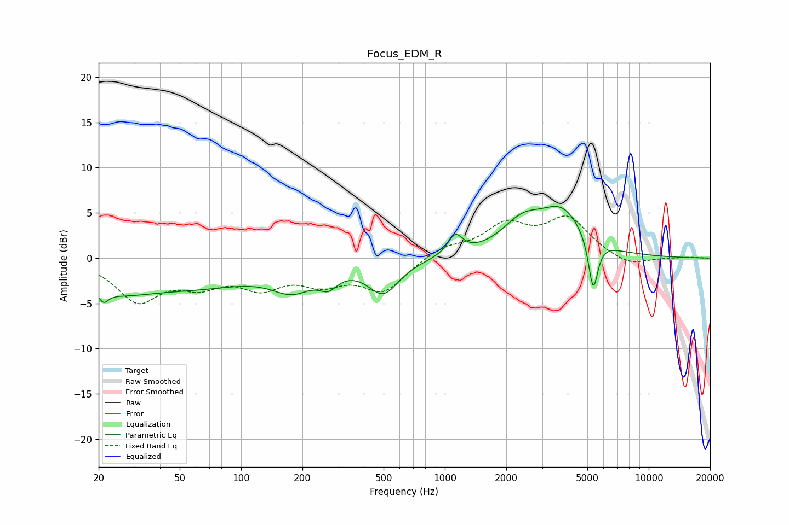

# Focus_EDM_R
See [usage instructions](https://github.com/jaakkopasanen/AutoEq#usage) for more options and info.

### Parametric EQs
Apply preamp of -5.8 dB when using parametric equalizer.

|   # | Type    |   Fc (Hz) |    Q |   Gain (dB) |
|-----|---------|-----------|------|-------------|
|   1 | Peaking |        21 | 5.86 |        -1.3 |
|   2 | Peaking |        24 | 0.8  |        -2.6 |
|   3 | Peaking |        61 | 0.47 |        -2.7 |
|   4 | Peaking |       178 | 1.39 |        -2.5 |
|   5 | Peaking |       268 | 3.15 |        -1.6 |
|   6 | Peaking |       499 | 1.85 |        -3.6 |
|   7 | Peaking |      1124 | 3.93 |         2.2 |
|   8 | Peaking |      2392 | 1.37 |         3.2 |
|   9 | Peaking |      3768 | 1.29 |         4.6 |
|  10 | Peaking |      5339 | 6    |        -5.8 |

### Fixed Band EQs
When using fixed band (also called graphic) equalizer, apply preamp of **-4.8 dB** (if available) and set gains manually with these parameters.

|   # | Type    |   Fc (Hz) |    Q |   Gain (dB) |
|-----|---------|-----------|------|-------------|
|   1 | Peaking |        31 | 1.41 |        -4.5 |
|   2 | Peaking |        62 | 1.41 |        -2.4 |
|   3 | Peaking |       125 | 1.41 |        -2.7 |
|   4 | Peaking |       250 | 1.41 |        -2.3 |
|   5 | Peaking |       500 | 1.41 |        -3.5 |
|   6 | Peaking |      1000 | 1.41 |         1.2 |
|   7 | Peaking |      2000 | 1.41 |         3.4 |
|   8 | Peaking |      4000 | 1.41 |         4.2 |
|   9 | Peaking |      8000 | 1.41 |        -1   |
|  10 | Peaking |     16000 | 1.41 |         0.1 |

### Graphs

