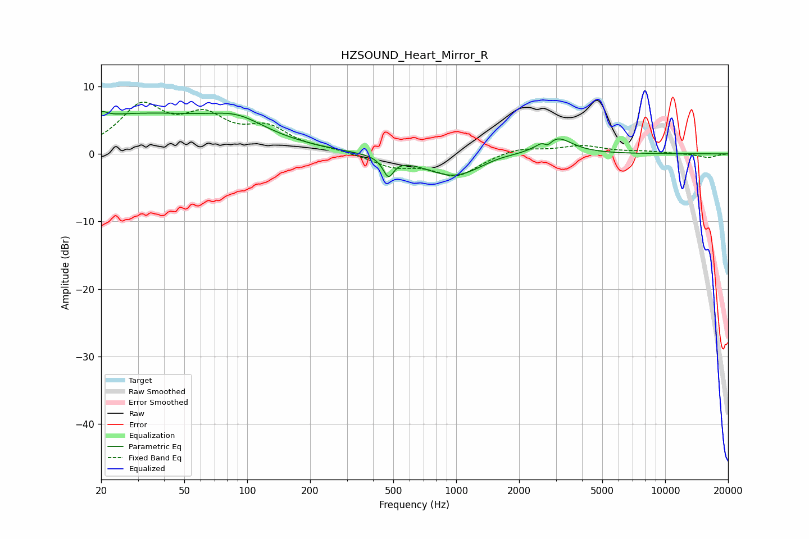

# HZSOUND_Heart_Mirror_R
See [usage instructions](https://github.com/jaakkopasanen/AutoEq#usage) for more options and info.

### Parametric EQs
Apply preamp of -6.4 dB when using parametric equalizer.

|   # | Type    |   Fc (Hz) |    Q |   Gain (dB) |
|-----|---------|-----------|------|-------------|
|   1 | Peaking |        20 | 6    |         0.8 |
|   2 | Peaking |        31 | 0.29 |         5.8 |
|   3 | Peaking |        71 | 5.95 |         0   |
|   4 | Peaking |        90 | 1.14 |         2.1 |
|   5 | Peaking |       474 | 5.64 |        -2.8 |
|   6 | Peaking |       979 | 1    |        -3.4 |
|   7 | Peaking |      1570 | 1.58 |         0.5 |
|   8 | Peaking |      2645 | 5.94 |         1.8 |
|   9 | Peaking |      2697 | 6    |        -2.4 |
|  10 | Peaking |      2978 | 1.88 |         2.8 |

### Fixed Band EQs
When using fixed band (also called graphic) equalizer, apply preamp of **-7.8 dB** (if available) and set gains manually with these parameters.

|   # | Type    |   Fc (Hz) |    Q |   Gain (dB) |
|-----|---------|-----------|------|-------------|
|   1 | Peaking |        31 | 1.41 |         6.6 |
|   2 | Peaking |        62 | 1.41 |         4.7 |
|   3 | Peaking |       125 | 1.41 |         3.3 |
|   4 | Peaking |       250 | 1.41 |         0.4 |
|   5 | Peaking |       500 | 1.41 |        -1.8 |
|   6 | Peaking |      1000 | 1.41 |        -3.2 |
|   7 | Peaking |      2000 | 1.41 |         1   |
|   8 | Peaking |      4000 | 1.41 |         1.1 |
|   9 | Peaking |      8000 | 1.41 |         0.3 |
|  10 | Peaking |     16000 | 1.41 |        -0.6 |

### Graphs

