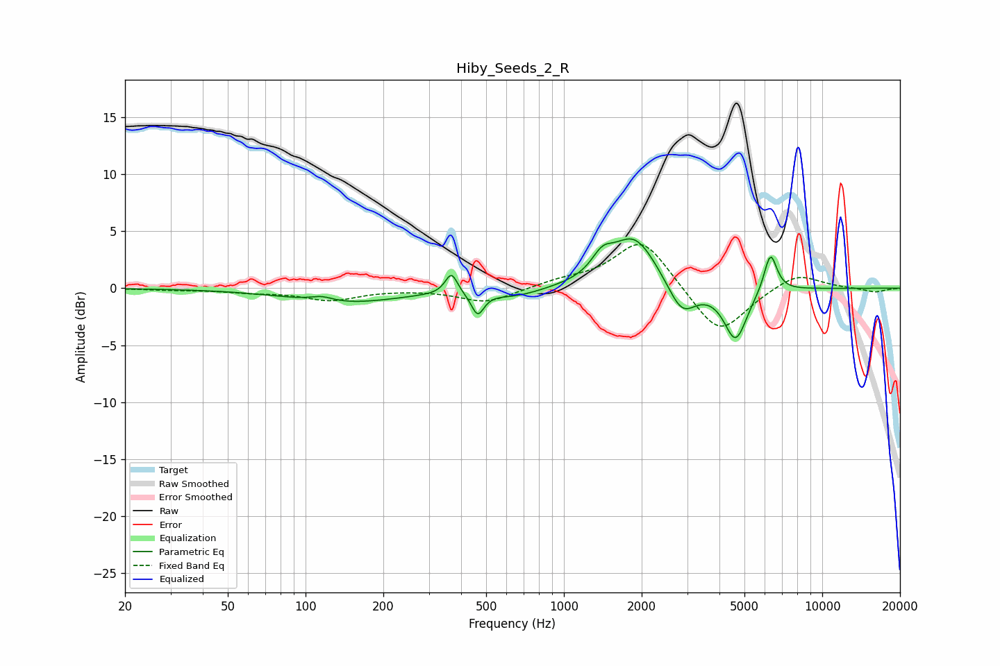

# Hiby_Seeds_2_R
See [usage instructions](https://github.com/jaakkopasanen/AutoEq#usage) for more options and info.

### Parametric EQs
Apply preamp of -4.4 dB when using parametric equalizer.

|   # | Type    |   Fc (Hz) |    Q |   Gain (dB) |
|-----|---------|-----------|------|-------------|
|   1 | Peaking |       116 | 3.23 |         0.4 |
|   2 | Peaking |       142 | 0.66 |        -1.3 |
|   3 | Peaking |       367 | 6    |         1.9 |
|   4 | Peaking |       464 | 5.93 |        -1.9 |
|   5 | Peaking |       652 | 1.39 |        -0.7 |
|   6 | Peaking |      1408 | 3.47 |         1.6 |
|   7 | Peaking |      1870 | 1.59 |         4.5 |
|   8 | Peaking |      2861 | 2.59 |        -2.8 |
|   9 | Peaking |      4620 | 3.15 |        -4.6 |
|  10 | Peaking |      6303 | 5.47 |         3.5 |

### Fixed Band EQs
When using fixed band (also called graphic) equalizer, apply preamp of **-3.9 dB** (if available) and set gains manually with these parameters.

|   # | Type    |   Fc (Hz) |    Q |   Gain (dB) |
|-----|---------|-----------|------|-------------|
|   1 | Peaking |        31 | 1.41 |        -0.1 |
|   2 | Peaking |        62 | 1.41 |        -0.3 |
|   3 | Peaking |       125 | 1.41 |        -1   |
|   4 | Peaking |       250 | 1.41 |        -0   |
|   5 | Peaking |       500 | 1.41 |        -1.3 |
|   6 | Peaking |      1000 | 1.41 |         0.6 |
|   7 | Peaking |      2000 | 1.41 |         4.5 |
|   8 | Peaking |      4000 | 1.41 |        -4.3 |
|   9 | Peaking |      8000 | 1.41 |         1.4 |
|  10 | Peaking |     16000 | 1.41 |        -0.4 |

### Graphs

