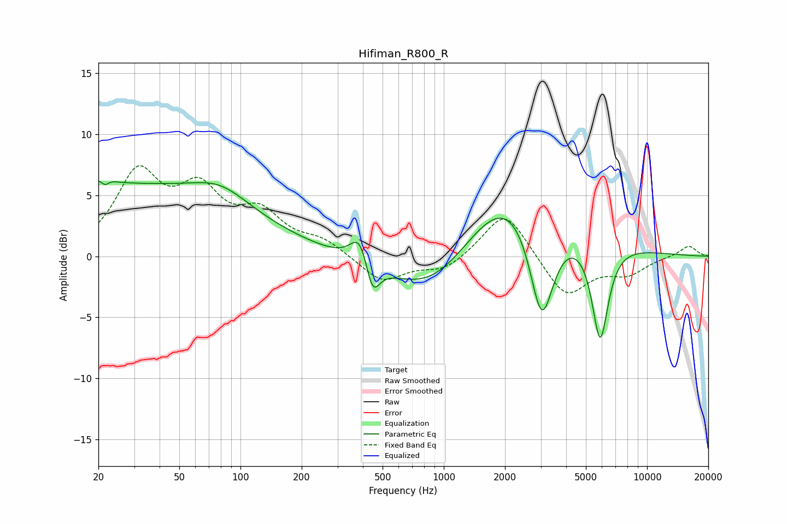

# Hifiman_R800_R
See [usage instructions](https://github.com/jaakkopasanen/AutoEq#usage) for more options and info.

### Parametric EQs
Apply preamp of -6.3 dB when using parametric equalizer.

|   # | Type    |   Fc (Hz) |    Q |   Gain (dB) |
|-----|---------|-----------|------|-------------|
|   1 | Peaking |        21 | 4.86 |         3.2 |
|   2 | Peaking |        21 | 5.67 |        -3.2 |
|   3 | Peaking |        23 | 0.18 |         5.8 |
|   4 | Peaking |        80 | 1.04 |         1.6 |
|   5 | Peaking |       388 | 3.12 |         2.6 |
|   6 | Peaking |       446 | 4.09 |        -2.9 |
|   7 | Peaking |       902 | 0.62 |        -4.7 |
|   8 | Peaking |      2226 | 0.54 |         7.7 |
|   9 | Peaking |      3031 | 2.14 |        -9.8 |
|  10 | Peaking |      5875 | 3.34 |        -8.3 |

### Fixed Band EQs
When using fixed band (also called graphic) equalizer, apply preamp of **-7.5 dB** (if available) and set gains manually with these parameters.

|   # | Type    |   Fc (Hz) |    Q |   Gain (dB) |
|-----|---------|-----------|------|-------------|
|   1 | Peaking |        31 | 1.41 |         6.4 |
|   2 | Peaking |        62 | 1.41 |         4.6 |
|   3 | Peaking |       125 | 1.41 |         3   |
|   4 | Peaking |       250 | 1.41 |         1.2 |
|   5 | Peaking |       500 | 1.41 |        -2.1 |
|   6 | Peaking |      1000 | 1.41 |        -1.2 |
|   7 | Peaking |      2000 | 1.41 |         3.9 |
|   8 | Peaking |      4000 | 1.41 |        -3.4 |
|   9 | Peaking |      8000 | 1.41 |        -1.3 |
|  10 | Peaking |     16000 | 1.41 |         0.9 |

### Graphs

