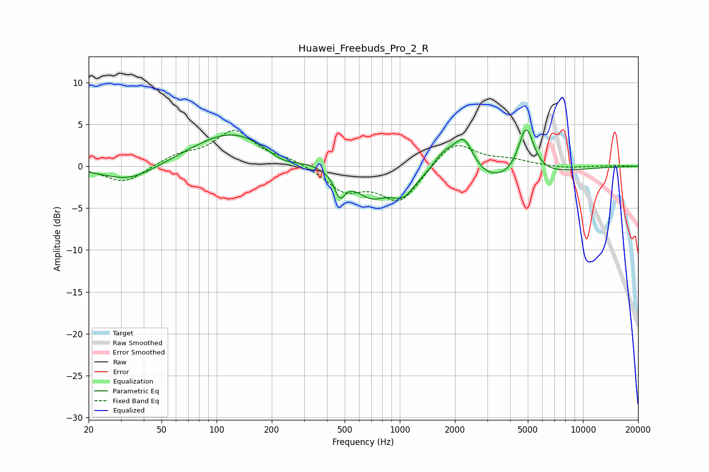

# Huawei_Freebuds_Pro_2_R
See [usage instructions](https://github.com/jaakkopasanen/AutoEq#usage) for more options and info.

### Parametric EQs
Apply preamp of -4.4 dB when using parametric equalizer.

|   # | Type    |   Fc (Hz) |    Q |   Gain (dB) |
|-----|---------|-----------|------|-------------|
|   1 | Peaking |        33 | 0.95 |        -2   |
|   2 | Peaking |       122 | 0.65 |         4.2 |
|   3 | Peaking |       227 | 1.67 |        -1.2 |
|   4 | Peaking |       470 | 4.73 |        -2.7 |
|   5 | Peaking |       697 | 1.48 |        -3.2 |
|   6 | Peaking |      1040 | 2.38 |        -2.2 |
|   7 | Peaking |      1736 | 2.19 |         2.5 |
|   8 | Peaking |      2238 | 2.51 |         4.5 |
|   9 | Peaking |      2930 | 0.51 |        -2.6 |
|  10 | Peaking |      4893 | 3.22 |         6   |

### Fixed Band EQs
When using fixed band (also called graphic) equalizer, apply preamp of **-4.4 dB** (if available) and set gains manually with these parameters.

|   # | Type    |   Fc (Hz) |    Q |   Gain (dB) |
|-----|---------|-----------|------|-------------|
|   1 | Peaking |        31 | 1.41 |        -2.1 |
|   2 | Peaking |        62 | 1.41 |         1.2 |
|   3 | Peaking |       125 | 1.41 |         4.1 |
|   4 | Peaking |       250 | 1.41 |         0.7 |
|   5 | Peaking |       500 | 1.41 |        -2.8 |
|   6 | Peaking |      1000 | 1.41 |        -4.2 |
|   7 | Peaking |      2000 | 1.41 |         3.1 |
|   8 | Peaking |      4000 | 1.41 |         0.7 |
|   9 | Peaking |      8000 | 1.41 |        -0.2 |
|  10 | Peaking |     16000 | 1.41 |         0.1 |

### Graphs

