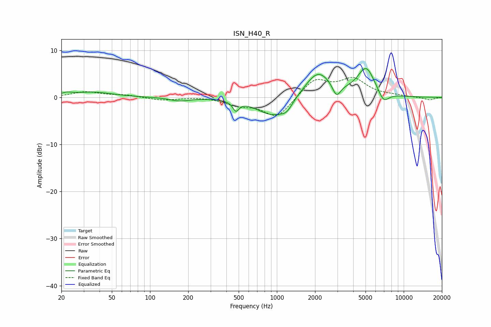

# ISN_H40_R
See [usage instructions](https://github.com/jaakkopasanen/AutoEq#usage) for more options and info.

### Parametric EQs
Apply preamp of -6.2 dB when using parametric equalizer.

|   # | Type    |   Fc (Hz) |    Q |   Gain (dB) |
|-----|---------|-----------|------|-------------|
|   1 | Peaking |        22 | 3.72 |         0.5 |
|   2 | Peaking |        35 | 0.89 |         1.1 |
|   3 | Peaking |       171 | 1.87 |        -0.7 |
|   4 | Peaking |       475 | 6    |        -2   |
|   5 | Peaking |       930 | 1.14 |        -4   |
|   6 | Peaking |      1196 | 3.2  |        -1.6 |
|   7 | Peaking |      2109 | 1.34 |         5.7 |
|   8 | Peaking |      2952 | 4.41 |        -2.8 |
|   9 | Peaking |      5055 | 2.04 |         6   |
|  10 | Peaking |      6942 | 3.24 |        -2.4 |

### Fixed Band EQs
When using fixed band (also called graphic) equalizer, apply preamp of **-4.3 dB** (if available) and set gains manually with these parameters.

|   # | Type    |   Fc (Hz) |    Q |   Gain (dB) |
|-----|---------|-----------|------|-------------|
|   1 | Peaking |        31 | 1.41 |         1.1 |
|   2 | Peaking |        62 | 1.41 |         0.5 |
|   3 | Peaking |       125 | 1.41 |        -0.6 |
|   4 | Peaking |       250 | 1.41 |         0.2 |
|   5 | Peaking |       500 | 1.41 |        -1.4 |
|   6 | Peaking |      1000 | 1.41 |        -4.3 |
|   7 | Peaking |      2000 | 1.41 |         3.9 |
|   8 | Peaking |      4000 | 1.41 |         3.7 |
|   9 | Peaking |      8000 | 1.41 |         0.3 |
|  10 | Peaking |     16000 | 1.41 |        -0.6 |

### Graphs

