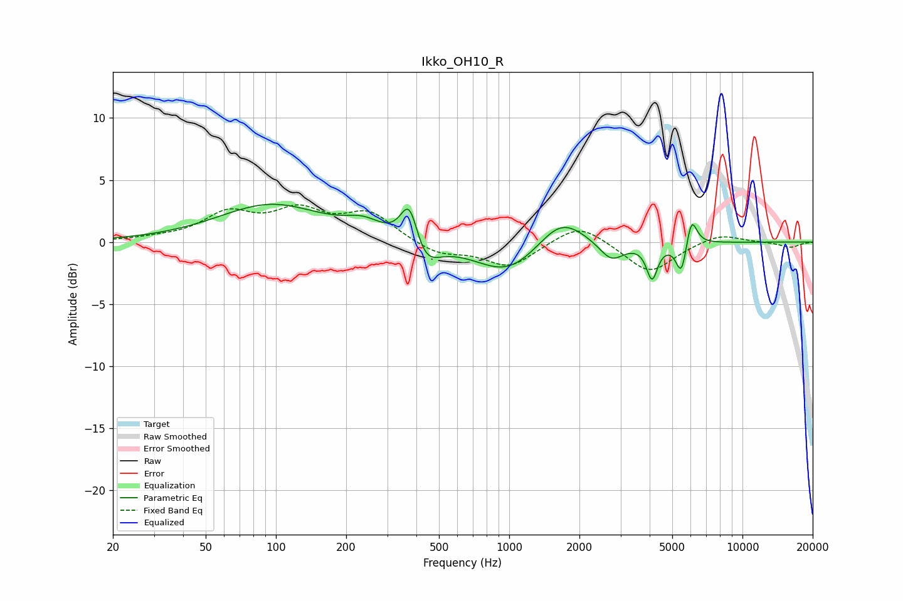

# Ikko_OH10_R
See [usage instructions](https://github.com/jaakkopasanen/AutoEq#usage) for more options and info.

### Parametric EQs
Apply preamp of -3.1 dB when using parametric equalizer.

|   # | Type    |   Fc (Hz) |    Q |   Gain (dB) |
|-----|---------|-----------|------|-------------|
|   1 | Peaking |        95 | 0.63 |         3   |
|   2 | Peaking |       237 | 1.8  |         1   |
|   3 | Peaking |       374 | 3.71 |         3.8 |
|   4 | Peaking |       431 | 2.34 |        -2.3 |
|   5 | Peaking |       988 | 1.01 |        -2.7 |
|   6 | Peaking |      1668 | 1.41 |         2.5 |
|   7 | Peaking |      2742 | 2.64 |        -1.6 |
|   8 | Peaking |      4097 | 6    |        -2.8 |
|   9 | Peaking |      5480 | 6    |        -2.8 |
|  10 | Peaking |      6039 | 6    |         2.5 |

### Fixed Band EQs
When using fixed band (also called graphic) equalizer, apply preamp of **-3.1 dB** (if available) and set gains manually with these parameters.

|   # | Type    |   Fc (Hz) |    Q |   Gain (dB) |
|-----|---------|-----------|------|-------------|
|   1 | Peaking |        31 | 1.41 |         0.2 |
|   2 | Peaking |        62 | 1.41 |         2.1 |
|   3 | Peaking |       125 | 1.41 |         2.2 |
|   4 | Peaking |       250 | 1.41 |         2.2 |
|   5 | Peaking |       500 | 1.41 |        -1   |
|   6 | Peaking |      1000 | 1.41 |        -2   |
|   7 | Peaking |      2000 | 1.41 |         1.7 |
|   8 | Peaking |      4000 | 1.41 |        -2.5 |
|   9 | Peaking |      8000 | 1.41 |         0.7 |
|  10 | Peaking |     16000 | 1.41 |        -0.4 |

### Graphs

