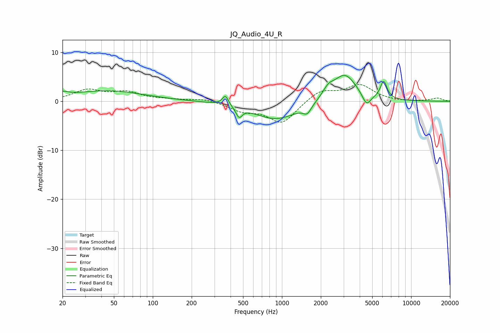

# JQ_Audio_4U_R
See [usage instructions](https://github.com/jaakkopasanen/AutoEq#usage) for more options and info.

### Parametric EQs
Apply preamp of -5.4 dB when using parametric equalizer.

|   # | Type    |   Fc (Hz) |    Q |   Gain (dB) |
|-----|---------|-----------|------|-------------|
|   1 | Peaking |        20 | 3.22 |         0.9 |
|   2 | Peaking |        44 | 0.51 |         2.1 |
|   3 | Peaking |       365 | 6    |         2   |
|   4 | Peaking |       466 | 5.94 |        -2   |
|   5 | Peaking |       907 | 0.8  |        -3.7 |
|   6 | Peaking |      1571 | 4.46 |        -1.7 |
|   7 | Peaking |      2283 | 3.31 |         1.7 |
|   8 | Peaking |      3062 | 1.54 |         5.6 |
|   9 | Peaking |      4516 | 4.21 |        -2.5 |
|  10 | Peaking |      6134 | 5.3  |         3.6 |

### Fixed Band EQs
When using fixed band (also called graphic) equalizer, apply preamp of **-3.5 dB** (if available) and set gains manually with these parameters.

|   # | Type    |   Fc (Hz) |    Q |   Gain (dB) |
|-----|---------|-----------|------|-------------|
|   1 | Peaking |        31 | 1.41 |         2.2 |
|   2 | Peaking |        62 | 1.41 |         1.7 |
|   3 | Peaking |       125 | 1.41 |         0.3 |
|   4 | Peaking |       250 | 1.41 |         0.6 |
|   5 | Peaking |       500 | 1.41 |        -1.7 |
|   6 | Peaking |      1000 | 1.41 |        -4.4 |
|   7 | Peaking |      2000 | 1.41 |         2.3 |
|   8 | Peaking |      4000 | 1.41 |         3.2 |
|   9 | Peaking |      8000 | 1.41 |        -0.1 |
|  10 | Peaking |     16000 | 1.41 |         0.6 |

### Graphs

