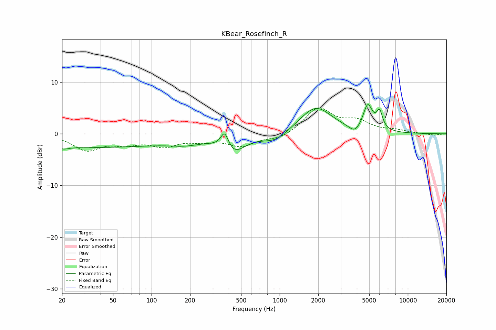

# KBear_Rosefinch_R
See [usage instructions](https://github.com/jaakkopasanen/AutoEq#usage) for more options and info.

### Parametric EQs
Apply preamp of -5.8 dB when using parametric equalizer.

|   # | Type    |   Fc (Hz) |    Q |   Gain (dB) |
|-----|---------|-----------|------|-------------|
|   1 | Peaking |        21 | 4.54 |        -0.4 |
|   2 | Peaking |        29 | 0.18 |        -2.6 |
|   3 | Peaking |       183 | 1.12 |        -1   |
|   4 | Peaking |       372 | 4.49 |         3.4 |
|   5 | Peaking |       431 | 1.57 |        -3.5 |
|   6 | Peaking |       923 | 1.46 |        -1.8 |
|   7 | Peaking |      1913 | 1.12 |         5.2 |
|   8 | Peaking |      3861 | 3.23 |        -1.5 |
|   9 | Peaking |      4871 | 3.87 |         5   |
|  10 | Peaking |      6017 | 5.83 |         3.3 |

### Fixed Band EQs
When using fixed band (also called graphic) equalizer, apply preamp of **-5.1 dB** (if available) and set gains manually with these parameters.

|   # | Type    |   Fc (Hz) |    Q |   Gain (dB) |
|-----|---------|-----------|------|-------------|
|   1 | Peaking |        31 | 1.41 |        -3   |
|   2 | Peaking |        62 | 1.41 |        -1.5 |
|   3 | Peaking |       125 | 1.41 |        -2.1 |
|   4 | Peaking |       250 | 1.41 |        -1.1 |
|   5 | Peaking |       500 | 1.41 |        -2.2 |
|   6 | Peaking |      1000 | 1.41 |        -1.1 |
|   7 | Peaking |      2000 | 1.41 |         4.9 |
|   8 | Peaking |      4000 | 1.41 |         2.1 |
|   9 | Peaking |      8000 | 1.41 |         0.5 |
|  10 | Peaking |     16000 | 1.41 |        -0.3 |

### Graphs

