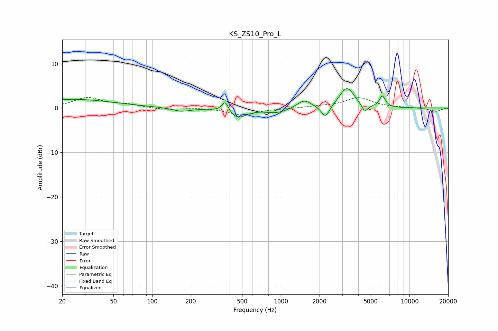

# KS_ZS10_Pro_L
See [usage instructions](https://github.com/jaakkopasanen/AutoEq#usage) for more options and info.

### Parametric EQs
Apply preamp of -4.5 dB when using parametric equalizer.

|   # | Type    |   Fc (Hz) |    Q |   Gain (dB) |
|-----|---------|-----------|------|-------------|
|   1 | Peaking |        24 | 0.44 |         2   |
|   2 | Peaking |       169 | 2    |        -0.8 |
|   3 | Peaking |       370 | 5.87 |         2.4 |
|   4 | Peaking |       463 | 2.17 |        -2.2 |
|   5 | Peaking |       929 | 1.62 |        -1.1 |
|   6 | Peaking |      1517 | 2.65 |         1.9 |
|   7 | Peaking |      2225 | 4.37 |        -2.8 |
|   8 | Peaking |      3267 | 2.45 |         4.6 |
|   9 | Peaking |      4490 | 5.49 |        -1.8 |
|  10 | Peaking |      6157 | 6    |         2.5 |

### Fixed Band EQs
When using fixed band (also called graphic) equalizer, apply preamp of **-2.5 dB** (if available) and set gains manually with these parameters.

|   # | Type    |   Fc (Hz) |    Q |   Gain (dB) |
|-----|---------|-----------|------|-------------|
|   1 | Peaking |        31 | 1.41 |         2.3 |
|   2 | Peaking |        62 | 1.41 |         0.7 |
|   3 | Peaking |       125 | 1.41 |        -0.4 |
|   4 | Peaking |       250 | 1.41 |         0.1 |
|   5 | Peaking |       500 | 1.41 |        -1.6 |
|   6 | Peaking |      1000 | 1.41 |        -0.1 |
|   7 | Peaking |      2000 | 1.41 |         0.3 |
|   8 | Peaking |      4000 | 1.41 |         2.3 |
|   9 | Peaking |      8000 | 1.41 |         0.1 |
|  10 | Peaking |     16000 | 1.41 |        -0.7 |

### Graphs

