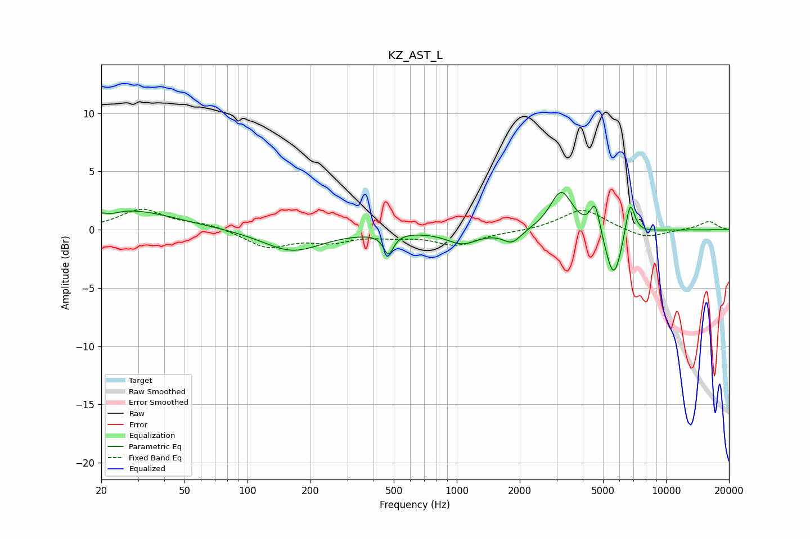

# KZ_AST_L
See [usage instructions](https://github.com/jaakkopasanen/AutoEq#usage) for more options and info.

### Parametric EQs
Apply preamp of -3.3 dB when using parametric equalizer.

|   # | Type    |   Fc (Hz) |    Q |   Gain (dB) |
|-----|---------|-----------|------|-------------|
|   1 | Peaking |        23 | 3.65 |        -0.3 |
|   2 | Peaking |        25 | 0.59 |         1.8 |
|   3 | Peaking |       164 | 1.01 |        -1.9 |
|   4 | Peaking |       472 | 6    |        -1.8 |
|   5 | Peaking |      1064 | 1.88 |        -1.1 |
|   6 | Peaking |      1838 | 3.16 |        -1.1 |
|   7 | Peaking |      3159 | 2.65 |         3.4 |
|   8 | Peaking |      4585 | 6    |         2.6 |
|   9 | Peaking |      5622 | 3.5  |        -4.5 |
|  10 | Peaking |      6734 | 6    |         3.2 |

### Fixed Band EQs
When using fixed band (also called graphic) equalizer, apply preamp of **-1.9 dB** (if available) and set gains manually with these parameters.

|   # | Type    |   Fc (Hz) |    Q |   Gain (dB) |
|-----|---------|-----------|------|-------------|
|   1 | Peaking |        31 | 1.41 |         1.7 |
|   2 | Peaking |        62 | 1.41 |         0.5 |
|   3 | Peaking |       125 | 1.41 |        -1.5 |
|   4 | Peaking |       250 | 1.41 |        -0.9 |
|   5 | Peaking |       500 | 1.41 |        -0.4 |
|   6 | Peaking |      1000 | 1.41 |        -1.3 |
|   7 | Peaking |      2000 | 1.41 |        -0.1 |
|   8 | Peaking |      4000 | 1.41 |         1.8 |
|   9 | Peaking |      8000 | 1.41 |        -0.8 |
|  10 | Peaking |     16000 | 1.41 |         0.7 |

### Graphs

