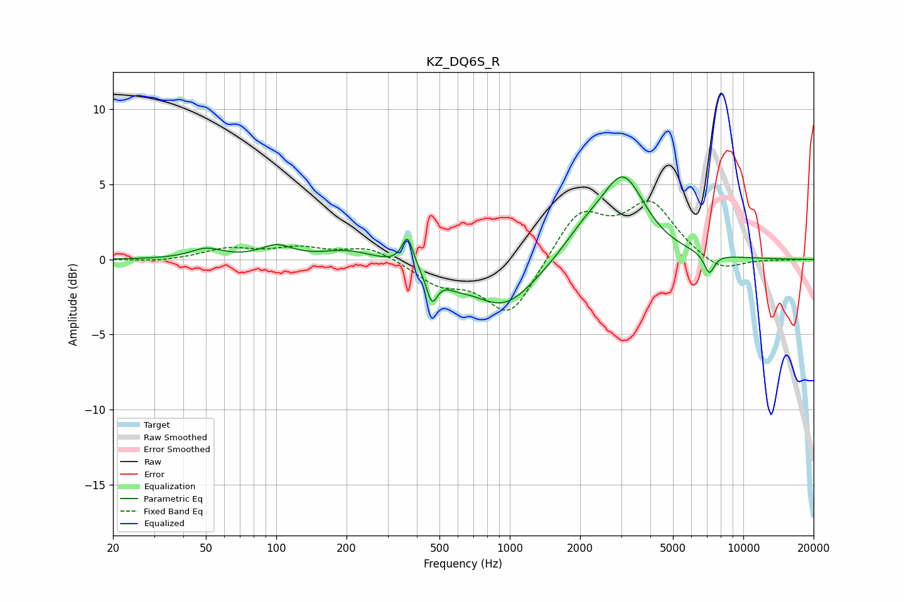

# KZ_DQ6S_R
See [usage instructions](https://github.com/jaakkopasanen/AutoEq#usage) for more options and info.

### Parametric EQs
Apply preamp of -5.6 dB when using parametric equalizer.

|   # | Type    |   Fc (Hz) |    Q |   Gain (dB) |
|-----|---------|-----------|------|-------------|
|   1 | Peaking |        50 | 2.13 |         0.7 |
|   2 | Peaking |       100 | 2.1  |         0.8 |
|   3 | Peaking |       203 | 1.33 |         0.6 |
|   4 | Peaking |       365 | 6    |         2   |
|   5 | Peaking |       464 | 6    |        -2   |
|   6 | Peaking |       587 | 2.27 |        -0.6 |
|   7 | Peaking |       946 | 1    |        -3.2 |
|   8 | Peaking |      2099 | 1.42 |         1.5 |
|   9 | Peaking |      3069 | 1.5  |         5.2 |
|  10 | Peaking |      7147 | 6    |        -1.4 |

### Fixed Band EQs
When using fixed band (also called graphic) equalizer, apply preamp of **-4.0 dB** (if available) and set gains manually with these parameters.

|   # | Type    |   Fc (Hz) |    Q |   Gain (dB) |
|-----|---------|-----------|------|-------------|
|   1 | Peaking |        31 | 1.41 |        -0.2 |
|   2 | Peaking |        62 | 1.41 |         0.7 |
|   3 | Peaking |       125 | 1.41 |         0.7 |
|   4 | Peaking |       250 | 1.41 |         0.9 |
|   5 | Peaking |       500 | 1.41 |        -1.5 |
|   6 | Peaking |      1000 | 1.41 |        -3.8 |
|   7 | Peaking |      2000 | 1.41 |         3.2 |
|   8 | Peaking |      4000 | 1.41 |         3.6 |
|   9 | Peaking |      8000 | 1.41 |        -1   |
|  10 | Peaking |     16000 | 1.41 |        -0   |

### Graphs

