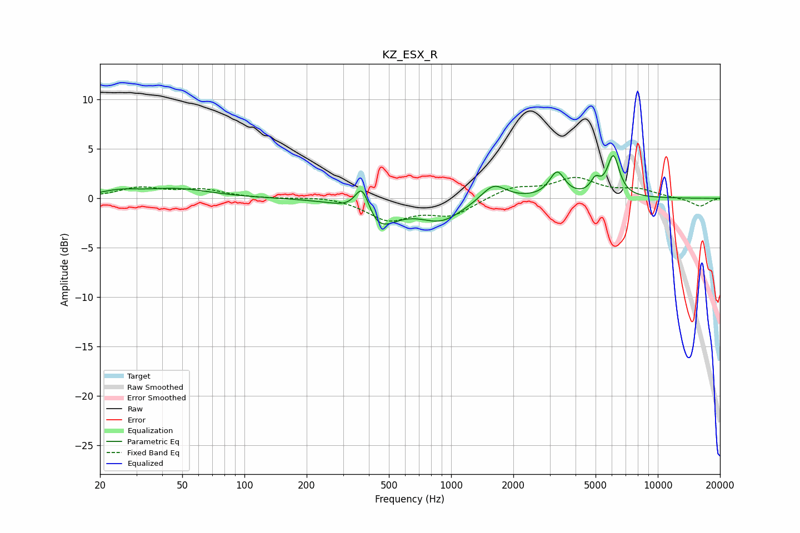

# KZ_ESX_R
See [usage instructions](https://github.com/jaakkopasanen/AutoEq#usage) for more options and info.

### Parametric EQs
Apply preamp of -4.4 dB when using parametric equalizer.

|   # | Type    |   Fc (Hz) |    Q |   Gain (dB) |
|-----|---------|-----------|------|-------------|
|   1 | Peaking |        25 | 1.53 |         0.6 |
|   2 | Peaking |        47 | 0.88 |         0.9 |
|   3 | Peaking |       372 | 3.94 |         3.3 |
|   4 | Peaking |       434 | 1.62 |        -2.8 |
|   5 | Peaking |       454 | 1.82 |        -0.3 |
|   6 | Peaking |       896 | 1.32 |        -2.1 |
|   7 | Peaking |      1605 | 2.38 |         1.8 |
|   8 | Peaking |      3257 | 3.82 |         2.5 |
|   9 | Peaking |      4985 | 5.98 |         1.3 |
|  10 | Peaking |      6096 | 4.7  |         4.1 |

### Fixed Band EQs
When using fixed band (also called graphic) equalizer, apply preamp of **-2.2 dB** (if available) and set gains manually with these parameters.

|   # | Type    |   Fc (Hz) |    Q |   Gain (dB) |
|-----|---------|-----------|------|-------------|
|   1 | Peaking |        31 | 1.41 |         1   |
|   2 | Peaking |        62 | 1.41 |         0.8 |
|   3 | Peaking |       125 | 1.41 |        -0   |
|   4 | Peaking |       250 | 1.41 |         0.3 |
|   5 | Peaking |       500 | 1.41 |        -2.1 |
|   6 | Peaking |      1000 | 1.41 |        -1.7 |
|   7 | Peaking |      2000 | 1.41 |         1.1 |
|   8 | Peaking |      4000 | 1.41 |         1.9 |
|   9 | Peaking |      8000 | 1.41 |         0.8 |
|  10 | Peaking |     16000 | 1.41 |        -0.8 |

### Graphs

