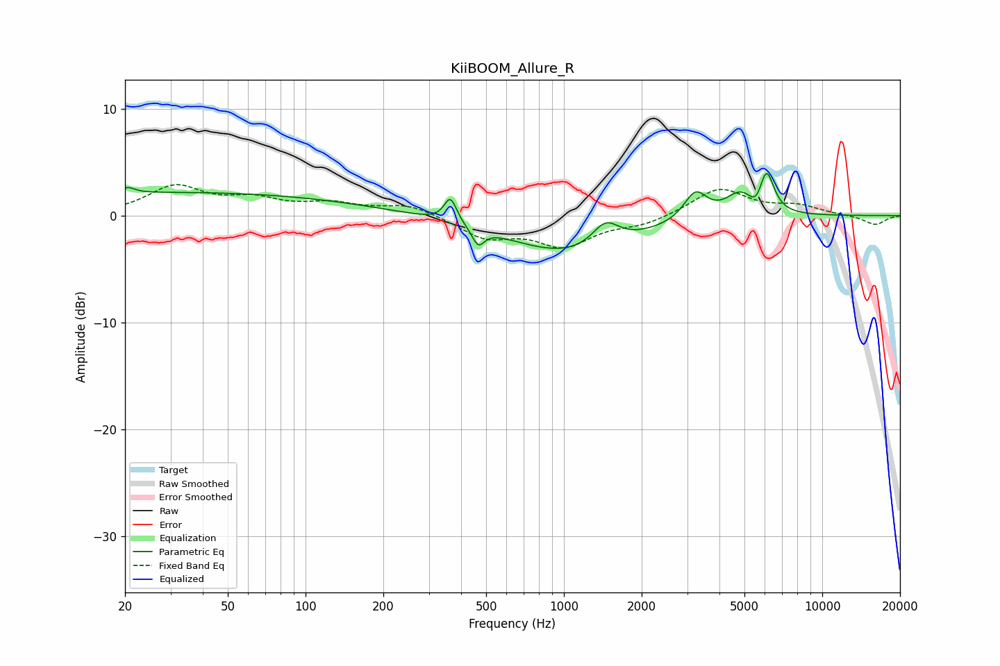

# KiiBOOM_Allure_R
See [usage instructions](https://github.com/jaakkopasanen/AutoEq#usage) for more options and info.

### Parametric EQs
Apply preamp of -4.1 dB when using parametric equalizer.

|   # | Type    |   Fc (Hz) |    Q |   Gain (dB) |
|-----|---------|-----------|------|-------------|
|   1 | Peaking |        21 | 5.59 |         0.5 |
|   2 | Peaking |        32 | 0.18 |         2.2 |
|   3 | Peaking |       364 | 5.86 |         2.3 |
|   4 | Peaking |       466 | 6    |        -1.6 |
|   5 | Peaking |      1053 | 0.59 |        -3.6 |
|   6 | Peaking |      1450 | 2.71 |         2.2 |
|   7 | Peaking |      3230 | 3.17 |         2.6 |
|   8 | Peaking |      4839 | 2.42 |         2.2 |
|   9 | Peaking |      5574 | 4.75 |        -1.4 |
|  10 | Peaking |      6079 | 4.83 |         4   |

### Fixed Band EQs
When using fixed band (also called graphic) equalizer, apply preamp of **-3.0 dB** (if available) and set gains manually with these parameters.

|   # | Type    |   Fc (Hz) |    Q |   Gain (dB) |
|-----|---------|-----------|------|-------------|
|   1 | Peaking |        31 | 1.41 |         2.6 |
|   2 | Peaking |        62 | 1.41 |         1.3 |
|   3 | Peaking |       125 | 1.41 |         1   |
|   4 | Peaking |       250 | 1.41 |         1   |
|   5 | Peaking |       500 | 1.41 |        -2   |
|   6 | Peaking |      1000 | 1.41 |        -2.7 |
|   7 | Peaking |      2000 | 1.41 |        -0.8 |
|   8 | Peaking |      4000 | 1.41 |         2.6 |
|   9 | Peaking |      8000 | 1.41 |         0.8 |
|  10 | Peaking |     16000 | 1.41 |        -0.9 |

### Graphs

