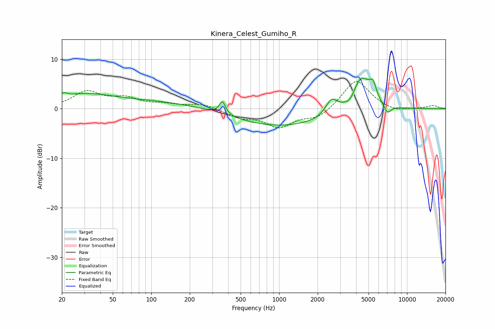

# Kinera_Celest_Gumiho_R
See [usage instructions](https://github.com/jaakkopasanen/AutoEq#usage) for more options and info.

### Parametric EQs
Apply preamp of -6.3 dB when using parametric equalizer.

|   # | Type    |   Fc (Hz) |    Q |   Gain (dB) |
|-----|---------|-----------|------|-------------|
|   1 | Peaking |        21 | 5.74 |         0.8 |
|   2 | Peaking |        28 | 0.68 |         2.1 |
|   3 | Peaking |       111 | 0.24 |         1.6 |
|   4 | Peaking |       360 | 6    |         2.6 |
|   5 | Peaking |       983 | 0.33 |        -3.8 |
|   6 | Peaking |      2566 | 3.12 |         3.1 |
|   7 | Peaking |      3599 | 4.1  |        -1.2 |
|   8 | Peaking |      4386 | 1.87 |         7   |
|   9 | Peaking |      5416 | 5.17 |         2.8 |
|  10 | Peaking |      7036 | 4.85 |        -1.8 |

### Fixed Band EQs
When using fixed band (also called graphic) equalizer, apply preamp of **-5.6 dB** (if available) and set gains manually with these parameters.

|   # | Type    |   Fc (Hz) |    Q |   Gain (dB) |
|-----|---------|-----------|------|-------------|
|   1 | Peaking |        31 | 1.41 |         3.3 |
|   2 | Peaking |        62 | 1.41 |         1.8 |
|   3 | Peaking |       125 | 1.41 |         0.7 |
|   4 | Peaking |       250 | 1.41 |         1   |
|   5 | Peaking |       500 | 1.41 |        -1.6 |
|   6 | Peaking |      1000 | 1.41 |        -3.5 |
|   7 | Peaking |      2000 | 1.41 |        -1.9 |
|   8 | Peaking |      4000 | 1.41 |         6   |
|   9 | Peaking |      8000 | 1.41 |        -0.7 |
|  10 | Peaking |     16000 | 1.41 |         0.6 |

### Graphs

