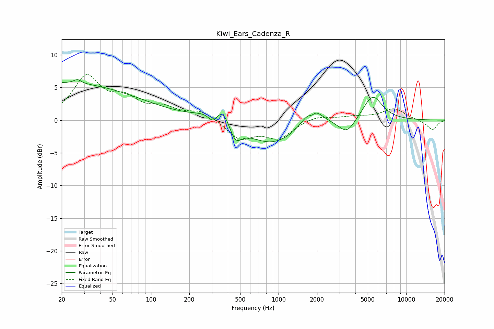

# Kiwi_Ears_Cadenza_R
See [usage instructions](https://github.com/jaakkopasanen/AutoEq#usage) for more options and info.

### Parametric EQs
Apply preamp of -6.3 dB when using parametric equalizer.

|   # | Type    |   Fc (Hz) |    Q |   Gain (dB) |
|-----|---------|-----------|------|-------------|
|   1 | Peaking |        20 | 0.22 |         5.7 |
|   2 | Peaking |        27 | 5.22 |         0.6 |
|   3 | Peaking |       309 | 3.4  |        -2.3 |
|   4 | Peaking |       361 | 1.48 |         4.4 |
|   5 | Peaking |       454 | 2.65 |        -3.8 |
|   6 | Peaking |       877 | 0.67 |        -3.8 |
|   7 | Peaking |      1820 | 5.95 |        -0.7 |
|   8 | Peaking |      1833 | 1.9  |         3.3 |
|   9 | Peaking |      3433 | 2.21 |        -2.2 |
|  10 | Peaking |      5452 | 1.84 |         3.9 |

### Fixed Band EQs
When using fixed band (also called graphic) equalizer, apply preamp of **-7.1 dB** (if available) and set gains manually with these parameters.

|   # | Type    |   Fc (Hz) |    Q |   Gain (dB) |
|-----|---------|-----------|------|-------------|
|   1 | Peaking |        31 | 1.41 |         6.4 |
|   2 | Peaking |        62 | 1.41 |         2.7 |
|   3 | Peaking |       125 | 1.41 |         1.6 |
|   4 | Peaking |       250 | 1.41 |         1.4 |
|   5 | Peaking |       500 | 1.41 |        -2.8 |
|   6 | Peaking |      1000 | 1.41 |        -2.6 |
|   7 | Peaking |      2000 | 1.41 |         0.7 |
|   8 | Peaking |      4000 | 1.41 |         0.5 |
|   9 | Peaking |      8000 | 1.41 |         1.7 |
|  10 | Peaking |     16000 | 1.41 |        -1.5 |

### Graphs

