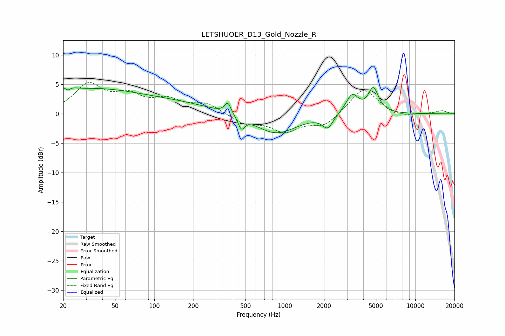

# LETSHUOER_D13_Gold_Nozzle_R
See [usage instructions](https://github.com/jaakkopasanen/AutoEq#usage) for more options and info.

### Parametric EQs
Apply preamp of -4.6 dB when using parametric equalizer.

|   # | Type    |   Fc (Hz) |    Q |   Gain (dB) |
|-----|---------|-----------|------|-------------|
|   1 | Peaking |        21 | 4.04 |         4   |
|   2 | Peaking |        22 | 5.15 |        -3.6 |
|   3 | Peaking |        33 | 0.37 |         4   |
|   4 | Peaking |       159 | 0.48 |         1.3 |
|   5 | Peaking |       366 | 5.87 |         1.9 |
|   6 | Peaking |       465 | 5.8  |        -2   |
|   7 | Peaking |       855 | 0.9  |        -3.4 |
|   8 | Peaking |      2134 | 3.54 |        -2.2 |
|   9 | Peaking |      3284 | 2.89 |         3.3 |
|  10 | Peaking |      4779 | 3.57 |         4.1 |

### Fixed Band EQs
When using fixed band (also called graphic) equalizer, apply preamp of **-5.4 dB** (if available) and set gains manually with these parameters.

|   # | Type    |   Fc (Hz) |    Q |   Gain (dB) |
|-----|---------|-----------|------|-------------|
|   1 | Peaking |        31 | 1.41 |         4.7 |
|   2 | Peaking |        62 | 1.41 |         2.7 |
|   3 | Peaking |       125 | 1.41 |         2.1 |
|   4 | Peaking |       250 | 1.41 |         1.7 |
|   5 | Peaking |       500 | 1.41 |        -1.6 |
|   6 | Peaking |      1000 | 1.41 |        -2.8 |
|   7 | Peaking |      2000 | 1.41 |        -2   |
|   8 | Peaking |      4000 | 1.41 |         4.5 |
|   9 | Peaking |      8000 | 1.41 |        -0.6 |
|  10 | Peaking |     16000 | 1.41 |         0.5 |

### Graphs

