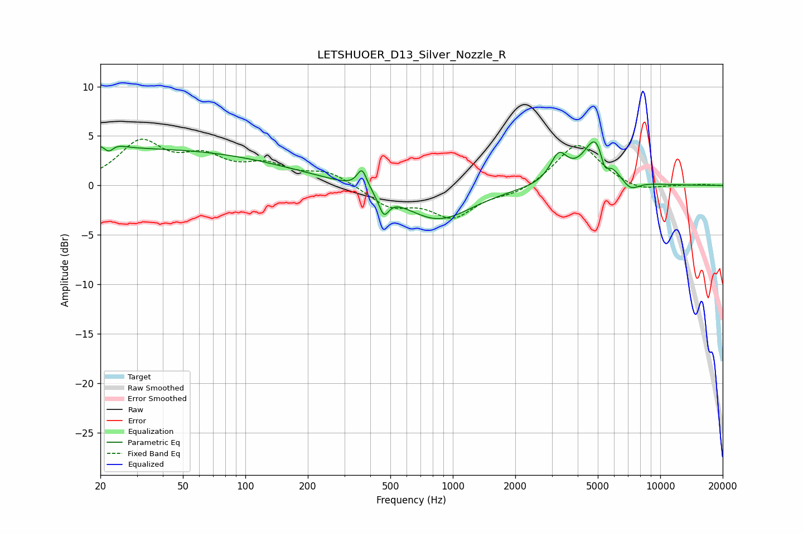

# LETSHUOER_D13_Silver_Nozzle_R
See [usage instructions](https://github.com/jaakkopasanen/AutoEq#usage) for more options and info.

### Parametric EQs
Apply preamp of -4.5 dB when using parametric equalizer.

|   # | Type    |   Fc (Hz) |    Q |   Gain (dB) |
|-----|---------|-----------|------|-------------|
|   1 | Peaking |        22 | 3.68 |         3.3 |
|   2 | Peaking |        22 | 4.73 |        -3.4 |
|   3 | Peaking |        31 | 0.19 |         3.6 |
|   4 | Peaking |       365 | 6    |         2   |
|   5 | Peaking |       465 | 5.99 |        -2   |
|   6 | Peaking |       847 | 0.86 |        -3.5 |
|   7 | Peaking |      3243 | 3.42 |         2.8 |
|   8 | Peaking |      4963 | 2.29 |         5.2 |
|   9 | Peaking |      5385 | 6    |        -2.3 |
|  10 | Peaking |      7157 | 3.17 |        -1.1 |

### Fixed Band EQs
When using fixed band (also called graphic) equalizer, apply preamp of **-4.8 dB** (if available) and set gains manually with these parameters.

|   # | Type    |   Fc (Hz) |    Q |   Gain (dB) |
|-----|---------|-----------|------|-------------|
|   1 | Peaking |        31 | 1.41 |         4.2 |
|   2 | Peaking |        62 | 1.41 |         2.4 |
|   3 | Peaking |       125 | 1.41 |         1.7 |
|   4 | Peaking |       250 | 1.41 |         1.3 |
|   5 | Peaking |       500 | 1.41 |        -2   |
|   6 | Peaking |      1000 | 1.41 |        -3   |
|   7 | Peaking |      2000 | 1.41 |        -0.8 |
|   8 | Peaking |      4000 | 1.41 |         4.4 |
|   9 | Peaking |      8000 | 1.41 |        -0.7 |
|  10 | Peaking |     16000 | 1.41 |         0.1 |

### Graphs

