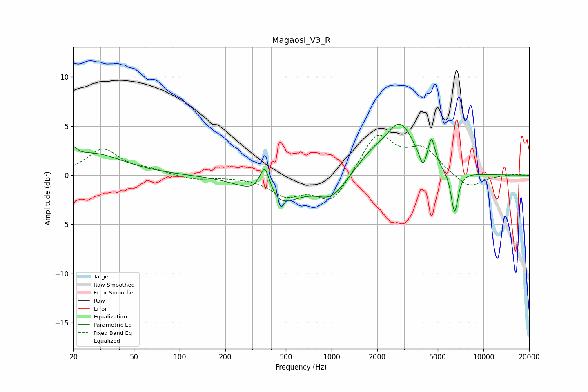

# Magaosi_V3_R
See [usage instructions](https://github.com/jaakkopasanen/AutoEq#usage) for more options and info.

### Parametric EQs
Apply preamp of -5.3 dB when using parametric equalizer.

|   # | Type    |   Fc (Hz) |    Q |   Gain (dB) |
|-----|---------|-----------|------|-------------|
|   1 | Peaking |        20 | 6    |         1   |
|   2 | Peaking |        26 | 0.7  |         2.2 |
|   3 | Peaking |       364 | 3.92 |         3.4 |
|   4 | Peaking |       431 | 0.98 |        -3.1 |
|   5 | Peaking |       994 | 1.47 |        -2.1 |
|   6 | Peaking |      1833 | 1.39 |         1.6 |
|   7 | Peaking |      2826 | 1.5  |         4.8 |
|   8 | Peaking |      4004 | 5.98 |        -1.7 |
|   9 | Peaking |      4548 | 6    |         2.8 |
|  10 | Peaking |      6454 | 6    |        -4.3 |

### Fixed Band EQs
When using fixed band (also called graphic) equalizer, apply preamp of **-4.2 dB** (if available) and set gains manually with these parameters.

|   # | Type    |   Fc (Hz) |    Q |   Gain (dB) |
|-----|---------|-----------|------|-------------|
|   1 | Peaking |        31 | 1.41 |         2.6 |
|   2 | Peaking |        62 | 1.41 |         0.4 |
|   3 | Peaking |       125 | 1.41 |        -0.5 |
|   4 | Peaking |       250 | 1.41 |        -0.1 |
|   5 | Peaking |       500 | 1.41 |        -1.9 |
|   6 | Peaking |      1000 | 1.41 |        -2.8 |
|   7 | Peaking |      2000 | 1.41 |         4.2 |
|   8 | Peaking |      4000 | 1.41 |         2.5 |
|   9 | Peaking |      8000 | 1.41 |        -1.4 |
|  10 | Peaking |     16000 | 1.41 |         0.1 |

### Graphs

