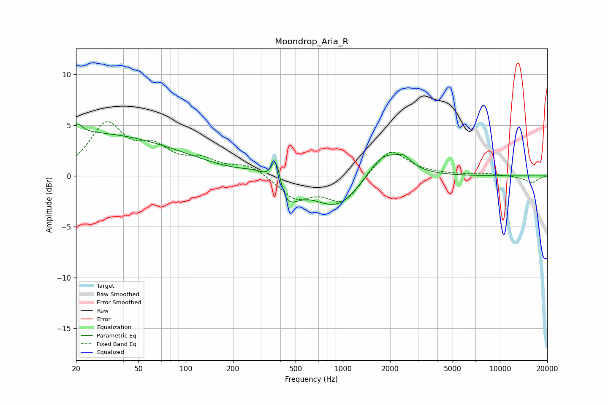

# Moondrop_Aria_R
See [usage instructions](https://github.com/jaakkopasanen/AutoEq#usage) for more options and info.

### Parametric EQs
Apply preamp of -5.2 dB when using parametric equalizer.

|   # | Type    |   Fc (Hz) |    Q |   Gain (dB) |
|-----|---------|-----------|------|-------------|
|   1 | Peaking |        20 | 0.2  |         4.3 |
|   2 | Peaking |        21 | 5.17 |         0.8 |
|   3 | Peaking |       282 | 1.67 |         0.7 |
|   4 | Peaking |       369 | 5.99 |        -0.4 |
|   5 | Peaking |       374 | 4.8  |         3.8 |
|   6 | Peaking |       430 | 1.92 |        -2.8 |
|   7 | Peaking |       925 | 0.94 |        -3.2 |
|   8 | Peaking |      1829 | 1.3  |         2.8 |
|   9 | Peaking |      2408 | 5.9  |         0.3 |
|  10 | Peaking |      2508 | 2.41 |         0.6 |

### Fixed Band EQs
When using fixed band (also called graphic) equalizer, apply preamp of **-5.4 dB** (if available) and set gains manually with these parameters.

|   # | Type    |   Fc (Hz) |    Q |   Gain (dB) |
|-----|---------|-----------|------|-------------|
|   1 | Peaking |        31 | 1.41 |         4.9 |
|   2 | Peaking |        62 | 1.41 |         2.3 |
|   3 | Peaking |       125 | 1.41 |         1.3 |
|   4 | Peaking |       250 | 1.41 |         1.1 |
|   5 | Peaking |       500 | 1.41 |        -2.2 |
|   6 | Peaking |      1000 | 1.41 |        -2.6 |
|   7 | Peaking |      2000 | 1.41 |         2.8 |
|   8 | Peaking |      4000 | 1.41 |         0.1 |
|   9 | Peaking |      8000 | 1.41 |         0.2 |
|  10 | Peaking |     16000 | 1.41 |        -0.7 |

### Graphs

