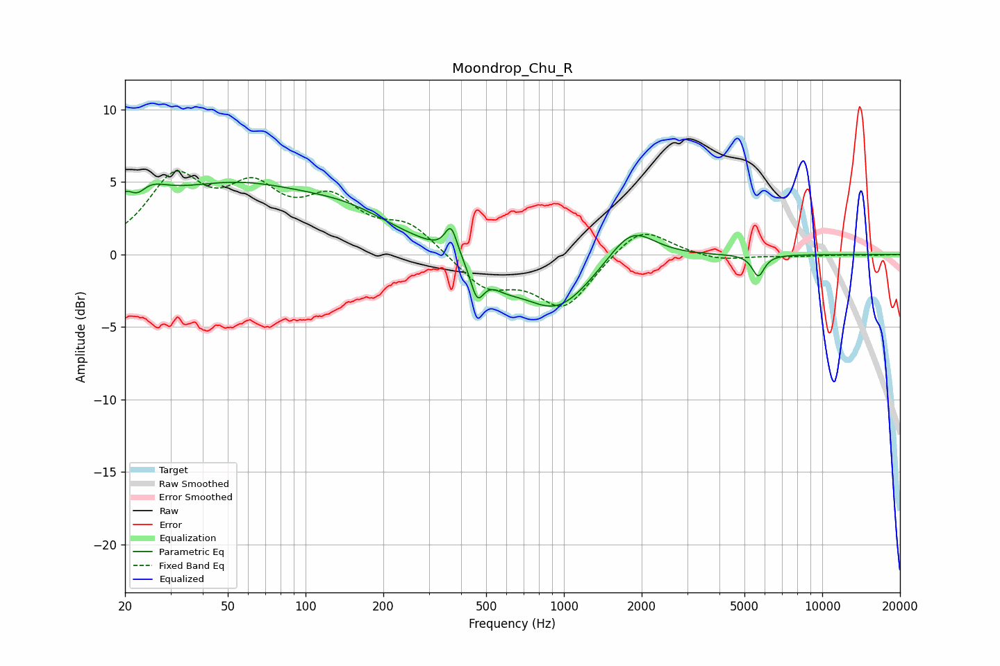

# Moondrop_Chu_R
See [usage instructions](https://github.com/jaakkopasanen/AutoEq#usage) for more options and info.

### Parametric EQs
Apply preamp of -5.1 dB when using parametric equalizer.

|   # | Type    |   Fc (Hz) |    Q |   Gain (dB) |
|-----|---------|-----------|------|-------------|
|   1 | Peaking |        22 | 2.07 |         4.9 |
|   2 | Peaking |        22 | 3.22 |        -3.4 |
|   3 | Peaking |        52 | 0.43 |         4.5 |
|   4 | Peaking |       149 | 0.77 |         1.5 |
|   5 | Peaking |       366 | 6    |         2   |
|   6 | Peaking |       462 | 5.49 |        -2.2 |
|   7 | Peaking |       587 | 1.96 |        -1   |
|   8 | Peaking |       935 | 1.03 |        -3.8 |
|   9 | Peaking |      1826 | 1.59 |         2.4 |
|  10 | Peaking |      5653 | 6    |        -1.5 |

### Fixed Band EQs
When using fixed band (also called graphic) equalizer, apply preamp of **-5.9 dB** (if available) and set gains manually with these parameters.

|   # | Type    |   Fc (Hz) |    Q |   Gain (dB) |
|-----|---------|-----------|------|-------------|
|   1 | Peaking |        31 | 1.41 |         4.9 |
|   2 | Peaking |        62 | 1.41 |         3.7 |
|   3 | Peaking |       125 | 1.41 |         3.2 |
|   4 | Peaking |       250 | 1.41 |         1.9 |
|   5 | Peaking |       500 | 1.41 |        -2.2 |
|   6 | Peaking |      1000 | 1.41 |        -3.6 |
|   7 | Peaking |      2000 | 1.41 |         2.1 |
|   8 | Peaking |      4000 | 1.41 |        -0.4 |
|   9 | Peaking |      8000 | 1.41 |        -0.1 |
|  10 | Peaking |     16000 | 1.41 |        -0   |

### Graphs

