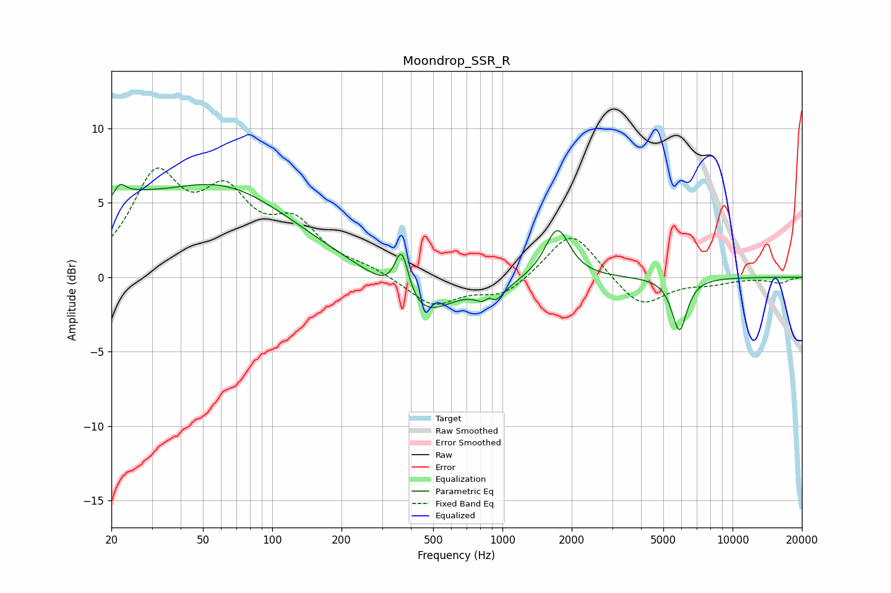

# Moondrop_SSR_R
See [usage instructions](https://github.com/jaakkopasanen/AutoEq#usage) for more options and info.

### Parametric EQs
Apply preamp of -6.3 dB when using parametric equalizer.

|   # | Type    |   Fc (Hz) |    Q |   Gain (dB) |
|-----|---------|-----------|------|-------------|
|   1 | Peaking |        21 | 0.94 |         2.6 |
|   2 | Peaking |        22 | 5.93 |         0.8 |
|   3 | Peaking |        60 | 0.43 |         5.8 |
|   4 | Peaking |       365 | 4.68 |         3.3 |
|   5 | Peaking |       440 | 1.06 |        -3   |
|   6 | Peaking |       878 | 5.82 |         2   |
|   7 | Peaking |       882 | 3.98 |        -2.9 |
|   8 | Peaking |       993 | 1.88 |        -0.2 |
|   9 | Peaking |      1733 | 2.67 |         3.4 |
|  10 | Peaking |      5873 | 4.2  |        -3.6 |

### Fixed Band EQs
When using fixed band (also called graphic) equalizer, apply preamp of **-7.4 dB** (if available) and set gains manually with these parameters.

|   # | Type    |   Fc (Hz) |    Q |   Gain (dB) |
|-----|---------|-----------|------|-------------|
|   1 | Peaking |        31 | 1.41 |         6.3 |
|   2 | Peaking |        62 | 1.41 |         4.7 |
|   3 | Peaking |       125 | 1.41 |         3.1 |
|   4 | Peaking |       250 | 1.41 |         0.5 |
|   5 | Peaking |       500 | 1.41 |        -1.9 |
|   6 | Peaking |      1000 | 1.41 |        -1.3 |
|   7 | Peaking |      2000 | 1.41 |         3.3 |
|   8 | Peaking |      4000 | 1.41 |        -2.1 |
|   9 | Peaking |      8000 | 1.41 |        -0.4 |
|  10 | Peaking |     16000 | 1.41 |        -0.4 |

### Graphs

