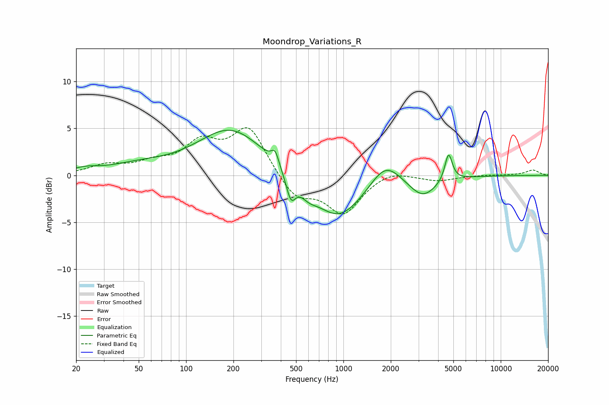

# Moondrop_Variations_R
See [usage instructions](https://github.com/jaakkopasanen/AutoEq#usage) for more options and info.

### Parametric EQs
Apply preamp of -4.9 dB when using parametric equalizer.

|   # | Type    |   Fc (Hz) |    Q |   Gain (dB) |
|-----|---------|-----------|------|-------------|
|   1 | Peaking |        23 | 1.79 |         0.5 |
|   2 | Peaking |        49 | 0.73 |         0.9 |
|   3 | Peaking |       193 | 0.66 |         5   |
|   4 | Peaking |       368 | 6    |         1.4 |
|   5 | Peaking |       464 | 4.69 |        -2.6 |
|   6 | Peaking |       600 | 2.71 |        -1   |
|   7 | Peaking |       929 | 0.88 |        -4.8 |
|   8 | Peaking |      1847 | 1.49 |         2.6 |
|   9 | Peaking |      3196 | 1.58 |        -2.2 |
|  10 | Peaking |      4659 | 6    |         3   |

### Fixed Band EQs
When using fixed band (also called graphic) equalizer, apply preamp of **-5.2 dB** (if available) and set gains manually with these parameters.

|   # | Type    |   Fc (Hz) |    Q |   Gain (dB) |
|-----|---------|-----------|------|-------------|
|   1 | Peaking |        31 | 1.41 |         1   |
|   2 | Peaking |        62 | 1.41 |         1.1 |
|   3 | Peaking |       125 | 1.41 |         3.1 |
|   4 | Peaking |       250 | 1.41 |         5   |
|   5 | Peaking |       500 | 1.41 |        -2.5 |
|   6 | Peaking |      1000 | 1.41 |        -4   |
|   7 | Peaking |      2000 | 1.41 |         0.7 |
|   8 | Peaking |      4000 | 1.41 |        -0.6 |
|   9 | Peaking |      8000 | 1.41 |         0   |
|  10 | Peaking |     16000 | 1.41 |         0.6 |

### Graphs

