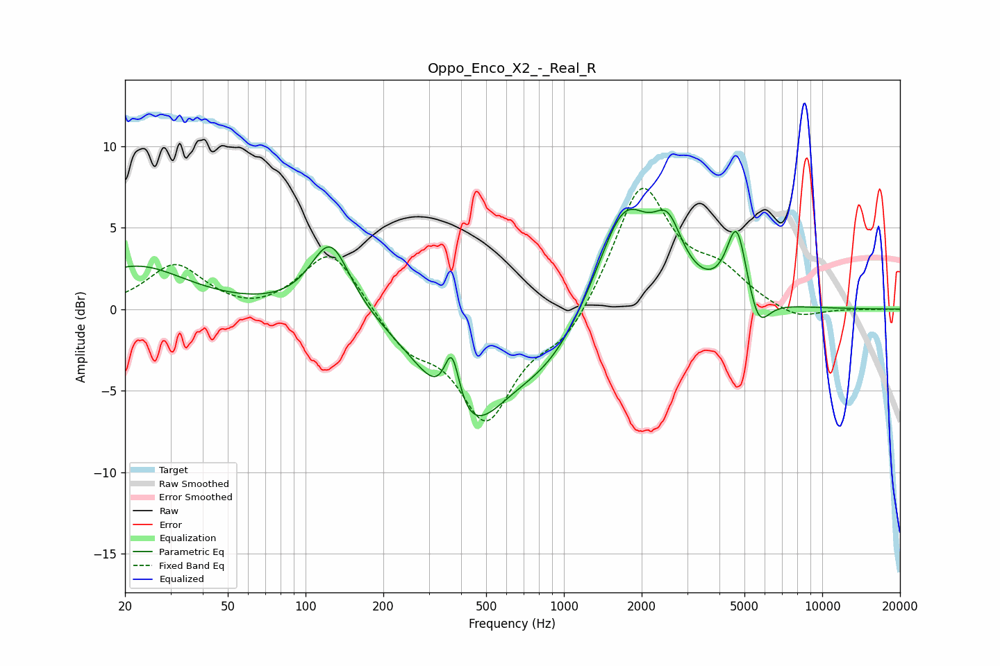

# Oppo_Enco_X2_-_Real_R
See [usage instructions](https://github.com/jaakkopasanen/AutoEq#usage) for more options and info.

### Parametric EQs
Apply preamp of -6.2 dB when using parametric equalizer.

|   # | Type    |   Fc (Hz) |    Q |   Gain (dB) |
|-----|---------|-----------|------|-------------|
|   1 | Peaking |        22 | 0.74 |         2.6 |
|   2 | Peaking |       125 | 1.85 |         4.5 |
|   3 | Peaking |       357 | 1.59 |        -0.5 |
|   4 | Peaking |       368 | 4.64 |         3.8 |
|   5 | Peaking |       424 | 0.92 |        -6.6 |
|   6 | Peaking |       882 | 0.91 |        -2.6 |
|   7 | Peaking |      1710 | 1.3  |         6.8 |
|   8 | Peaking |      2527 | 2.54 |         3.2 |
|   9 | Peaking |      4666 | 3.58 |         4.7 |
|  10 | Peaking |      5658 | 3.37 |        -2.2 |

### Fixed Band EQs
When using fixed band (also called graphic) equalizer, apply preamp of **-7.5 dB** (if available) and set gains manually with these parameters.

|   # | Type    |   Fc (Hz) |    Q |   Gain (dB) |
|-----|---------|-----------|------|-------------|
|   1 | Peaking |        31 | 1.41 |         2.7 |
|   2 | Peaking |        62 | 1.41 |        -0.4 |
|   3 | Peaking |       125 | 1.41 |         3.8 |
|   4 | Peaking |       250 | 1.41 |        -2.2 |
|   5 | Peaking |       500 | 1.41 |        -6.5 |
|   6 | Peaking |      1000 | 1.41 |        -1.9 |
|   7 | Peaking |      2000 | 1.41 |         7.7 |
|   8 | Peaking |      4000 | 1.41 |         1.9 |
|   9 | Peaking |      8000 | 1.41 |        -0.8 |
|  10 | Peaking |     16000 | 1.41 |        -0   |

### Graphs

