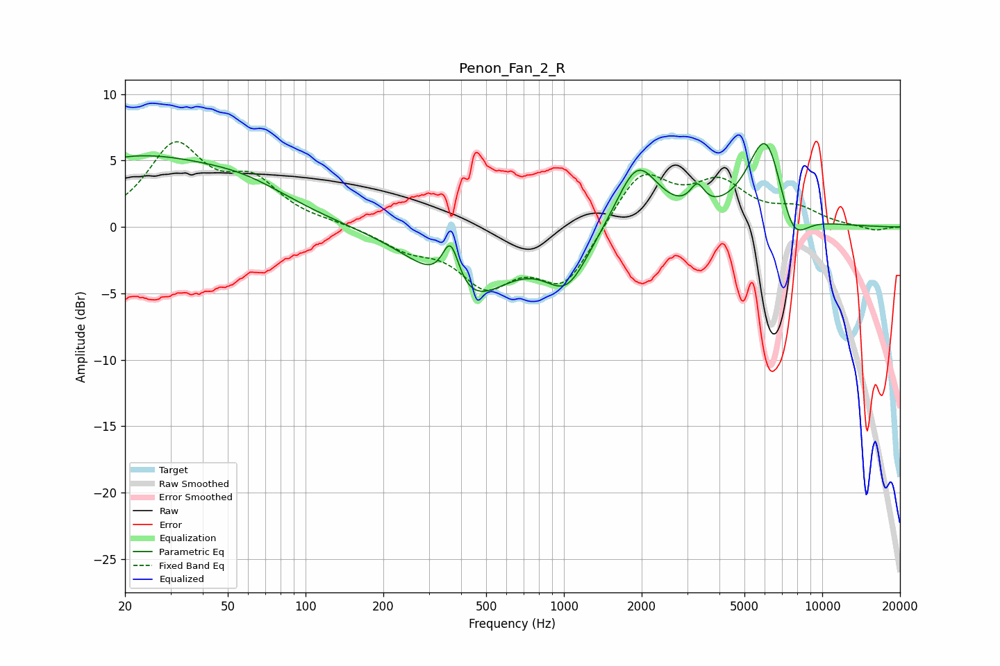

# Penon_Fan_2_R
See [usage instructions](https://github.com/jaakkopasanen/AutoEq#usage) for more options and info.

### Parametric EQs
Apply preamp of -6.4 dB when using parametric equalizer.

|   # | Type    |   Fc (Hz) |    Q |   Gain (dB) |
|-----|---------|-----------|------|-------------|
|   1 | Peaking |        20 | 5.83 |        -0   |
|   2 | Peaking |        21 | 0.4  |         5   |
|   3 | Peaking |        59 | 0.77 |         1.5 |
|   4 | Peaking |       364 | 4.21 |         3.7 |
|   5 | Peaking |       420 | 0.87 |        -5.5 |
|   6 | Peaking |      1027 | 1.63 |        -3.9 |
|   7 | Peaking |      1923 | 1.72 |         5   |
|   8 | Peaking |      3284 | 5.11 |         1.7 |
|   9 | Peaking |      6070 | 1.88 |         7.4 |
|  10 | Peaking |      7645 | 2.29 |        -3.4 |

### Fixed Band EQs
When using fixed band (also called graphic) equalizer, apply preamp of **-6.5 dB** (if available) and set gains manually with these parameters.

|   # | Type    |   Fc (Hz) |    Q |   Gain (dB) |
|-----|---------|-----------|------|-------------|
|   1 | Peaking |        31 | 1.41 |         5.9 |
|   2 | Peaking |        62 | 1.41 |         3   |
|   3 | Peaking |       125 | 1.41 |         0.2 |
|   4 | Peaking |       250 | 1.41 |        -1.4 |
|   5 | Peaking |       500 | 1.41 |        -3.9 |
|   6 | Peaking |      1000 | 1.41 |        -4.2 |
|   7 | Peaking |      2000 | 1.41 |         4.2 |
|   8 | Peaking |      4000 | 1.41 |         3   |
|   9 | Peaking |      8000 | 1.41 |         1.2 |
|  10 | Peaking |     16000 | 1.41 |        -0.3 |

### Graphs

