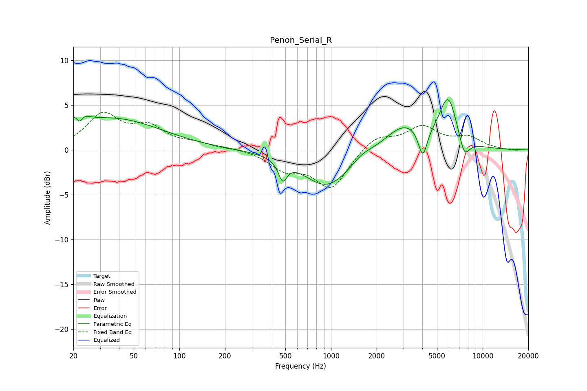

# Penon_Serial_R
See [usage instructions](https://github.com/jaakkopasanen/AutoEq#usage) for more options and info.

### Parametric EQs
Apply preamp of -5.7 dB when using parametric equalizer.

|   # | Type    |   Fc (Hz) |    Q |   Gain (dB) |
|-----|---------|-----------|------|-------------|
|   1 | Peaking |        22 | 3.7  |         3.2 |
|   2 | Peaking |        22 | 5.75 |        -2.7 |
|   3 | Peaking |        37 | 0.45 |         3.5 |
|   4 | Peaking |       480 | 5.06 |        -2.1 |
|   5 | Peaking |       939 | 0.91 |        -4.2 |
|   6 | Peaking |      1607 | 2.29 |         0.6 |
|   7 | Peaking |      3068 | 1.08 |         2.9 |
|   8 | Peaking |      4029 | 4.79 |        -3.3 |
|   9 | Peaking |      5925 | 2.33 |         5.5 |
|  10 | Peaking |      7569 | 3.79 |        -2.3 |

### Fixed Band EQs
When using fixed band (also called graphic) equalizer, apply preamp of **-4.3 dB** (if available) and set gains manually with these parameters.

|   # | Type    |   Fc (Hz) |    Q |   Gain (dB) |
|-----|---------|-----------|------|-------------|
|   1 | Peaking |        31 | 1.41 |         3.8 |
|   2 | Peaking |        62 | 1.41 |         2.3 |
|   3 | Peaking |       125 | 1.41 |         0.6 |
|   4 | Peaking |       250 | 1.41 |         0.2 |
|   5 | Peaking |       500 | 1.41 |        -2   |
|   6 | Peaking |      1000 | 1.41 |        -4.2 |
|   7 | Peaking |      2000 | 1.41 |         1.6 |
|   8 | Peaking |      4000 | 1.41 |         2.4 |
|   9 | Peaking |      8000 | 1.41 |         1.3 |
|  10 | Peaking |     16000 | 1.41 |        -0.1 |

### Graphs

