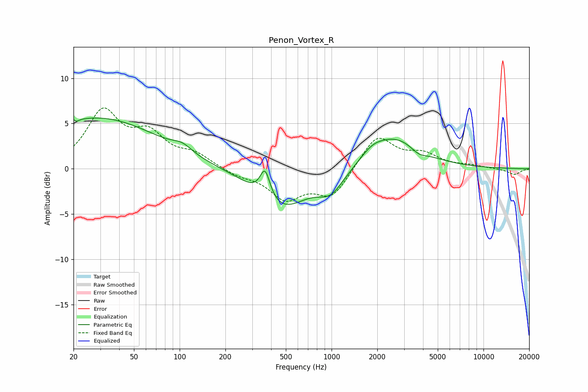

# Penon_Vortex_R
See [usage instructions](https://github.com/jaakkopasanen/AutoEq#usage) for more options and info.

### Parametric EQs
Apply preamp of -5.7 dB when using parametric equalizer.

|   # | Type    |   Fc (Hz) |    Q |   Gain (dB) |
|-----|---------|-----------|------|-------------|
|   1 | Peaking |        20 | 5.62 |         3.4 |
|   2 | Peaking |        20 | 6    |        -3.3 |
|   3 | Peaking |        29 | 0.35 |         5.6 |
|   4 | Peaking |       104 | 2.28 |         0.8 |
|   5 | Peaking |       365 | 4.26 |         3.2 |
|   6 | Peaking |       466 | 0.83 |        -4.4 |
|   7 | Peaking |       991 | 1.65 |        -2.2 |
|   8 | Peaking |      1850 | 1.86 |         1   |
|   9 | Peaking |      2639 | 0.84 |         3.4 |
|  10 | Peaking |      3739 | 2.63 |        -0.7 |

### Fixed Band EQs
When using fixed band (also called graphic) equalizer, apply preamp of **-6.8 dB** (if available) and set gains manually with these parameters.

|   # | Type    |   Fc (Hz) |    Q |   Gain (dB) |
|-----|---------|-----------|------|-------------|
|   1 | Peaking |        31 | 1.41 |         6.1 |
|   2 | Peaking |        62 | 1.41 |         3.3 |
|   3 | Peaking |       125 | 1.41 |         1.4 |
|   4 | Peaking |       250 | 1.41 |        -0.7 |
|   5 | Peaking |       500 | 1.41 |        -3.1 |
|   6 | Peaking |      1000 | 1.41 |        -3   |
|   7 | Peaking |      2000 | 1.41 |         3.7 |
|   8 | Peaking |      4000 | 1.41 |         1.4 |
|   9 | Peaking |      8000 | 1.41 |         0.3 |
|  10 | Peaking |     16000 | 1.41 |        -0.7 |

### Graphs

