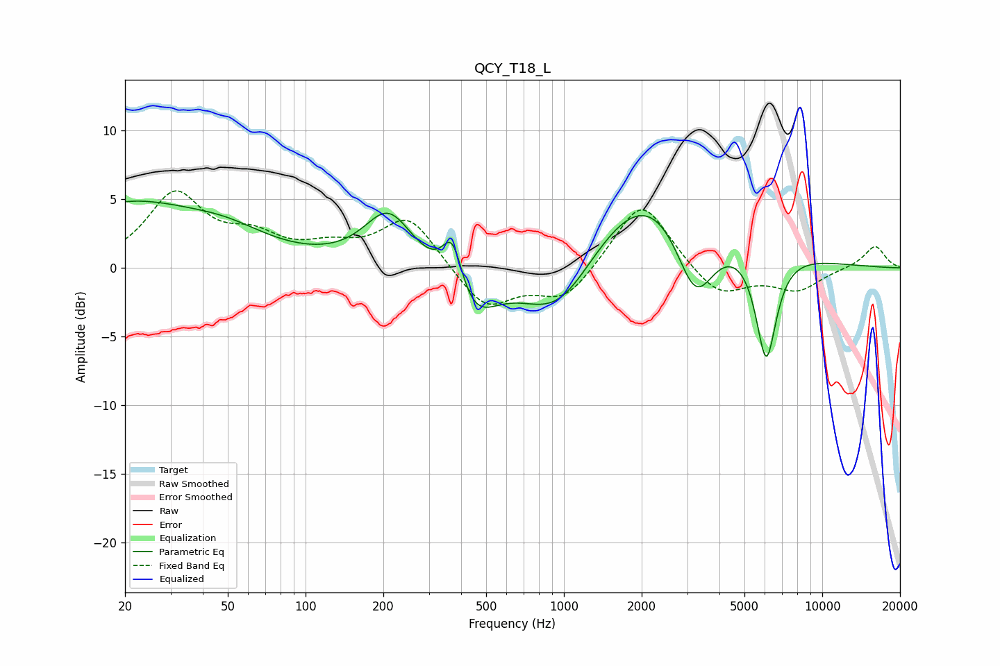

# QCY_T18_L
See [usage instructions](https://github.com/jaakkopasanen/AutoEq#usage) for more options and info.

### Parametric EQs
Apply preamp of -5.0 dB when using parametric equalizer.

|   # | Type    |   Fc (Hz) |    Q |   Gain (dB) |
|-----|---------|-----------|------|-------------|
|   1 | Peaking |        20 | 5.57 |        -0   |
|   2 | Peaking |        20 | 0.43 |         4.7 |
|   3 | Peaking |        50 | 0.95 |         1   |
|   4 | Peaking |       209 | 1.51 |         4.1 |
|   5 | Peaking |       371 | 3.51 |         4   |
|   6 | Peaking |       439 | 1.54 |        -3.8 |
|   7 | Peaking |       957 | 0.9  |        -5.5 |
|   8 | Peaking |      2232 | 0.51 |         7.6 |
|   9 | Peaking |      3224 | 1.71 |        -6.7 |
|  10 | Peaking |      6069 | 3.37 |        -8.2 |

### Fixed Band EQs
When using fixed band (also called graphic) equalizer, apply preamp of **-5.7 dB** (if available) and set gains manually with these parameters.

|   # | Type    |   Fc (Hz) |    Q |   Gain (dB) |
|-----|---------|-----------|------|-------------|
|   1 | Peaking |        31 | 1.41 |         5.2 |
|   2 | Peaking |        62 | 1.41 |         1.8 |
|   3 | Peaking |       125 | 1.41 |         1.2 |
|   4 | Peaking |       250 | 1.41 |         3.7 |
|   5 | Peaking |       500 | 1.41 |        -3   |
|   6 | Peaking |      1000 | 1.41 |        -2.4 |
|   7 | Peaking |      2000 | 1.41 |         5.1 |
|   8 | Peaking |      4000 | 1.41 |        -2.2 |
|   9 | Peaking |      8000 | 1.41 |        -1.6 |
|  10 | Peaking |     16000 | 1.41 |         1.6 |

### Graphs

