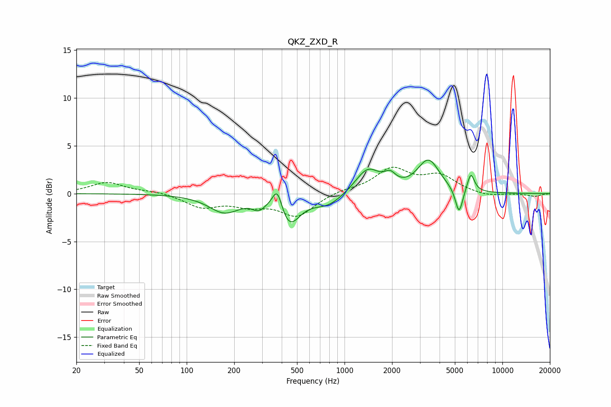

# QKZ_ZXD_R
See [usage instructions](https://github.com/jaakkopasanen/AutoEq#usage) for more options and info.

### Parametric EQs
Apply preamp of -3.6 dB when using parametric equalizer.

|   # | Type    |   Fc (Hz) |    Q |   Gain (dB) |
|-----|---------|-----------|------|-------------|
|   1 | Peaking |       173 | 1.45 |        -1.9 |
|   2 | Peaking |       285 | 3.67 |        -0.9 |
|   3 | Peaking |       375 | 4.56 |         2.5 |
|   4 | Peaking |       445 | 2.15 |        -3.1 |
|   5 | Peaking |       786 | 1.49 |        -1.2 |
|   6 | Peaking |      1401 | 1.82 |         2.6 |
|   7 | Peaking |      1945 | 4.01 |         1.1 |
|   8 | Peaking |      3402 | 2.01 |         3.4 |
|   9 | Peaking |      5314 | 5.93 |        -2.7 |
|  10 | Peaking |      6311 | 6    |         1.9 |

### Fixed Band EQs
When using fixed band (also called graphic) equalizer, apply preamp of **-2.9 dB** (if available) and set gains manually with these parameters.

|   # | Type    |   Fc (Hz) |    Q |   Gain (dB) |
|-----|---------|-----------|------|-------------|
|   1 | Peaking |        31 | 1.41 |         1.2 |
|   2 | Peaking |        62 | 1.41 |         0.2 |
|   3 | Peaking |       125 | 1.41 |        -1.3 |
|   4 | Peaking |       250 | 1.41 |        -1   |
|   5 | Peaking |       500 | 1.41 |        -2.3 |
|   6 | Peaking |      1000 | 1.41 |         0.4 |
|   7 | Peaking |      2000 | 1.41 |         2.5 |
|   8 | Peaking |      4000 | 1.41 |         1.7 |
|   9 | Peaking |      8000 | 1.41 |        -0.3 |
|  10 | Peaking |     16000 | 1.41 |        -0.3 |

### Graphs

