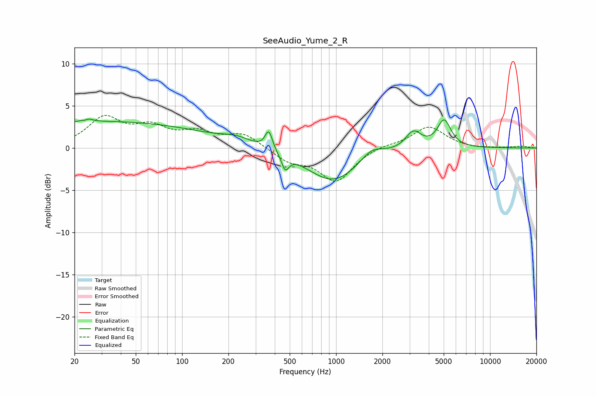

# SeeAudio_Yume_2_R
See [usage instructions](https://github.com/jaakkopasanen/AutoEq#usage) for more options and info.

### Parametric EQs
Apply preamp of -3.5 dB when using parametric equalizer.

|   # | Type    |   Fc (Hz) |    Q |   Gain (dB) |
|-----|---------|-----------|------|-------------|
|   1 | Peaking |        24 | 6    |        -2.5 |
|   2 | Peaking |        24 | 5.53 |         2.8 |
|   3 | Peaking |        31 | 0.2  |         3.1 |
|   4 | Peaking |       226 | 1.51 |         0.7 |
|   5 | Peaking |       366 | 6    |         2.3 |
|   6 | Peaking |       467 | 5.99 |        -1.8 |
|   7 | Peaking |       961 | 0.83 |        -4   |
|   8 | Peaking |      1704 | 1.91 |         1.4 |
|   9 | Peaking |      3180 | 2.77 |         2.1 |
|  10 | Peaking |      5030 | 3.18 |         3.2 |

### Fixed Band EQs
When using fixed band (also called graphic) equalizer, apply preamp of **-4.0 dB** (if available) and set gains manually with these parameters.

|   # | Type    |   Fc (Hz) |    Q |   Gain (dB) |
|-----|---------|-----------|------|-------------|
|   1 | Peaking |        31 | 1.41 |         3.4 |
|   2 | Peaking |        62 | 1.41 |         2.1 |
|   3 | Peaking |       125 | 1.41 |         1.6 |
|   4 | Peaking |       250 | 1.41 |         1.6 |
|   5 | Peaking |       500 | 1.41 |        -1.5 |
|   6 | Peaking |      1000 | 1.41 |        -3.9 |
|   7 | Peaking |      2000 | 1.41 |         0.4 |
|   8 | Peaking |      4000 | 1.41 |         2.5 |
|   9 | Peaking |      8000 | 1.41 |        -0.1 |
|  10 | Peaking |     16000 | 1.41 |         0.2 |

### Graphs

