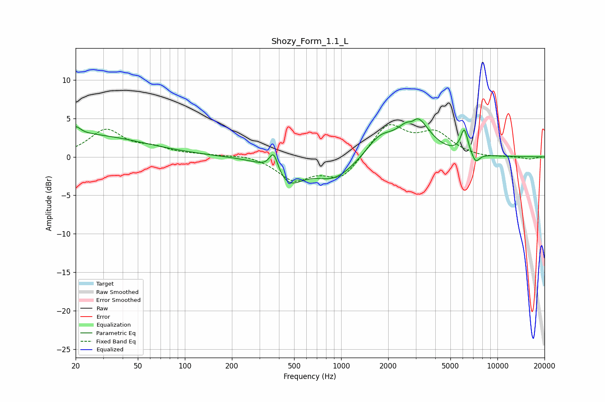

# Shozy_Form_1.1_L
See [usage instructions](https://github.com/jaakkopasanen/AutoEq#usage) for more options and info.

### Parametric EQs
Apply preamp of -5.0 dB when using parametric equalizer.

|   # | Type    |   Fc (Hz) |    Q |   Gain (dB) |
|-----|---------|-----------|------|-------------|
|   1 | Peaking |        20 | 0.33 |         3   |
|   2 | Peaking |        20 | 4.65 |         1   |
|   3 | Peaking |       370 | 5.13 |         2.6 |
|   4 | Peaking |       461 | 1.55 |        -3   |
|   5 | Peaking |       908 | 1.1  |        -2.8 |
|   6 | Peaking |      1763 | 1.66 |         2.4 |
|   7 | Peaking |      2839 | 4.84 |        -1.2 |
|   8 | Peaking |      2945 | 1.69 |         5.5 |
|   9 | Peaking |      6134 | 6    |         3.1 |
|  10 | Peaking |      7247 | 5.31 |        -1.3 |

### Fixed Band EQs
When using fixed band (also called graphic) equalizer, apply preamp of **-4.3 dB** (if available) and set gains manually with these parameters.

|   # | Type    |   Fc (Hz) |    Q |   Gain (dB) |
|-----|---------|-----------|------|-------------|
|   1 | Peaking |        31 | 1.41 |         3.4 |
|   2 | Peaking |        62 | 1.41 |         1   |
|   3 | Peaking |       125 | 1.41 |         0.2 |
|   4 | Peaking |       250 | 1.41 |         0.3 |
|   5 | Peaking |       500 | 1.41 |        -2.9 |
|   6 | Peaking |      1000 | 1.41 |        -2.9 |
|   7 | Peaking |      2000 | 1.41 |         4.3 |
|   8 | Peaking |      4000 | 1.41 |         2.9 |
|   9 | Peaking |      8000 | 1.41 |        -0.2 |
|  10 | Peaking |     16000 | 1.41 |        -0.3 |

### Graphs

