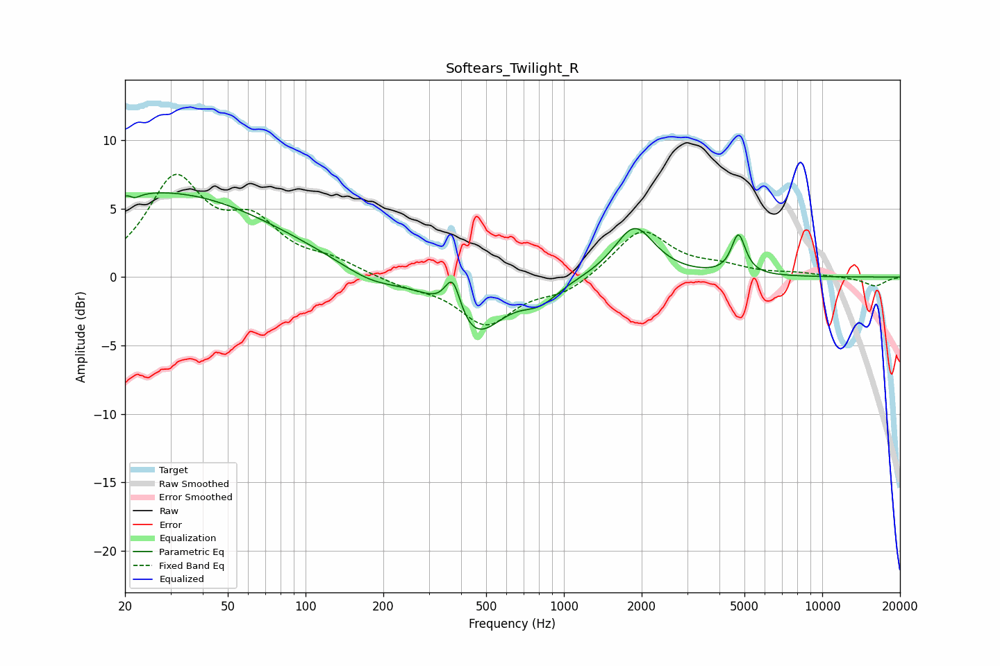

# Softears_Twilight_R
See [usage instructions](https://github.com/jaakkopasanen/AutoEq#usage) for more options and info.

### Parametric EQs
Apply preamp of -6.3 dB when using parametric equalizer.

|   # | Type    |   Fc (Hz) |    Q |   Gain (dB) |
|-----|---------|-----------|------|-------------|
|   1 | Peaking |        20 | 1.26 |         0.4 |
|   2 | Peaking |        21 | 5.94 |         3.2 |
|   3 | Peaking |        21 | 5.92 |        -3.4 |
|   4 | Peaking |        30 | 0.33 |         6   |
|   5 | Peaking |       178 | 1.23 |        -1   |
|   6 | Peaking |       371 | 4.53 |         2.9 |
|   7 | Peaking |       449 | 1.34 |        -4.3 |
|   8 | Peaking |       808 | 1.96 |        -1.3 |
|   9 | Peaking |      1877 | 1.84 |         3.8 |
|  10 | Peaking |      4738 | 5.29 |         2.9 |

### Fixed Band EQs
When using fixed band (also called graphic) equalizer, apply preamp of **-7.6 dB** (if available) and set gains manually with these parameters.

|   # | Type    |   Fc (Hz) |    Q |   Gain (dB) |
|-----|---------|-----------|------|-------------|
|   1 | Peaking |        31 | 1.41 |         6.9 |
|   2 | Peaking |        62 | 1.41 |         3.4 |
|   3 | Peaking |       125 | 1.41 |         1   |
|   4 | Peaking |       250 | 1.41 |        -0.6 |
|   5 | Peaking |       500 | 1.41 |        -3.4 |
|   6 | Peaking |      1000 | 1.41 |        -1.1 |
|   7 | Peaking |      2000 | 1.41 |         3.5 |
|   8 | Peaking |      4000 | 1.41 |         0.6 |
|   9 | Peaking |      8000 | 1.41 |         0.2 |
|  10 | Peaking |     16000 | 1.41 |        -0.7 |

### Graphs

