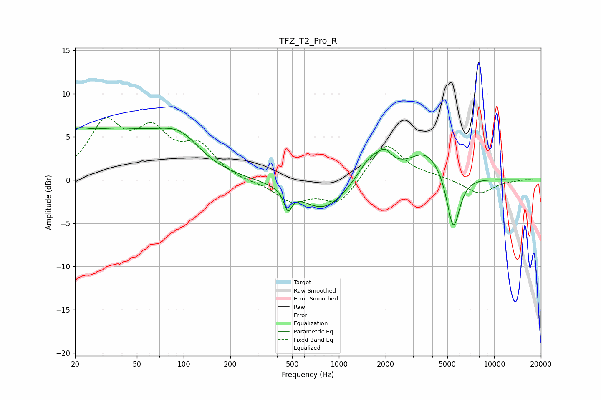

# TFZ_T2_Pro_R
See [usage instructions](https://github.com/jaakkopasanen/AutoEq#usage) for more options and info.

### Parametric EQs
Apply preamp of -6.2 dB when using parametric equalizer.

|   # | Type    |   Fc (Hz) |    Q |   Gain (dB) |
|-----|---------|-----------|------|-------------|
|   1 | Peaking |        20 | 1.87 |         1.9 |
|   2 | Peaking |        35 | 0.49 |         5.1 |
|   3 | Peaking |        71 | 1.08 |         0.9 |
|   4 | Peaking |        97 | 1.13 |         2.8 |
|   5 | Peaking |       470 | 5.66 |        -2.3 |
|   6 | Peaking |       799 | 0.94 |        -3.6 |
|   7 | Peaking |      1602 | 1.66 |         2.8 |
|   8 | Peaking |      1991 | 3.17 |         1.6 |
|   9 | Peaking |      3670 | 1.19 |         3.4 |
|  10 | Peaking |      5456 | 3.29 |        -6.8 |

### Fixed Band EQs
When using fixed band (also called graphic) equalizer, apply preamp of **-7.3 dB** (if available) and set gains manually with these parameters.

|   # | Type    |   Fc (Hz) |    Q |   Gain (dB) |
|-----|---------|-----------|------|-------------|
|   1 | Peaking |        31 | 1.41 |         6.1 |
|   2 | Peaking |        62 | 1.41 |         4.9 |
|   3 | Peaking |       125 | 1.41 |         3.5 |
|   4 | Peaking |       250 | 1.41 |        -0.2 |
|   5 | Peaking |       500 | 1.41 |        -2.4 |
|   6 | Peaking |      1000 | 1.41 |        -2.8 |
|   7 | Peaking |      2000 | 1.41 |         4.4 |
|   8 | Peaking |      4000 | 1.41 |         0.3 |
|   9 | Peaking |      8000 | 1.41 |        -1.6 |
|  10 | Peaking |     16000 | 1.41 |         0.1 |

### Graphs

