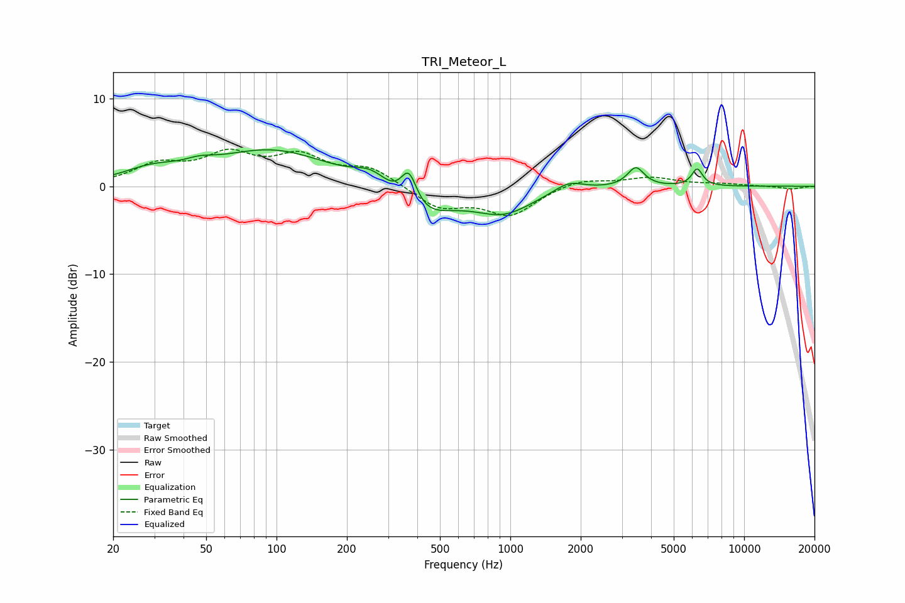

# TRI_Meteor_L
See [usage instructions](https://github.com/jaakkopasanen/AutoEq#usage) for more options and info.

### Parametric EQs
Apply preamp of -4.3 dB when using parametric equalizer.

|   # | Type    |   Fc (Hz) |    Q |   Gain (dB) |
|-----|---------|-----------|------|-------------|
|   1 | Peaking |        29 | 1.22 |         1.4 |
|   2 | Peaking |        47 | 2.23 |         0.7 |
|   3 | Peaking |        96 | 0.57 |         4.1 |
|   4 | Peaking |       256 | 1.91 |         1.9 |
|   5 | Peaking |       368 | 4.04 |         4.1 |
|   6 | Peaking |       405 | 1.08 |        -3.8 |
|   7 | Peaking |       937 | 1.12 |        -2.8 |
|   8 | Peaking |      1779 | 2.27 |         1.1 |
|   9 | Peaking |      3441 | 4.01 |         2.2 |
|  10 | Peaking |      6295 | 6    |         2   |

### Fixed Band EQs
When using fixed band (also called graphic) equalizer, apply preamp of **-4.3 dB** (if available) and set gains manually with these parameters.

|   # | Type    |   Fc (Hz) |    Q |   Gain (dB) |
|-----|---------|-----------|------|-------------|
|   1 | Peaking |        31 | 1.41 |         2.2 |
|   2 | Peaking |        62 | 1.41 |         3.2 |
|   3 | Peaking |       125 | 1.41 |         3   |
|   4 | Peaking |       250 | 1.41 |         2   |
|   5 | Peaking |       500 | 1.41 |        -2.4 |
|   6 | Peaking |      1000 | 1.41 |        -3.2 |
|   7 | Peaking |      2000 | 1.41 |         0.9 |
|   8 | Peaking |      4000 | 1.41 |         1   |
|   9 | Peaking |      8000 | 1.41 |         0.2 |
|  10 | Peaking |     16000 | 1.41 |        -0.3 |

### Graphs

