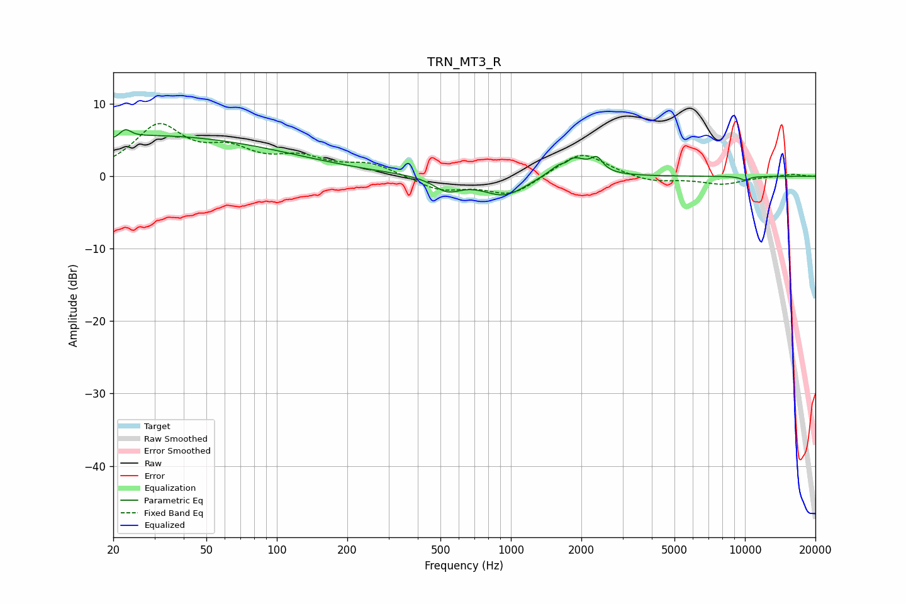

# TRN_MT3_R
See [usage instructions](https://github.com/jaakkopasanen/AutoEq#usage) for more options and info.

### Parametric EQs
Apply preamp of -6.5 dB when using parametric equalizer.

|   # | Type    |   Fc (Hz) |    Q |   Gain (dB) |
|-----|---------|-----------|------|-------------|
|   1 | Peaking |        20 | 2.36 |        -0.8 |
|   2 | Peaking |        22 | 0.18 |         5.8 |
|   3 | Peaking |        22 | 5.86 |         1.3 |
|   4 | Peaking |       535 | 2.45 |        -1.9 |
|   5 | Peaking |       937 | 1.5  |        -2.7 |
|   6 | Peaking |      1684 | 5.88 |         1.9 |
|   7 | Peaking |      1696 | 5.98 |        -2.6 |
|   8 | Peaking |      1792 | 2.27 |         3.3 |
|   9 | Peaking |      2330 | 5.82 |         1.7 |
|  10 | Peaking |     10000 | 5.51 |        -0.5 |

### Fixed Band EQs
When using fixed band (also called graphic) equalizer, apply preamp of **-7.4 dB** (if available) and set gains manually with these parameters.

|   # | Type    |   Fc (Hz) |    Q |   Gain (dB) |
|-----|---------|-----------|------|-------------|
|   1 | Peaking |        31 | 1.41 |         6.7 |
|   2 | Peaking |        62 | 1.41 |         2.9 |
|   3 | Peaking |       125 | 1.41 |         2.2 |
|   4 | Peaking |       250 | 1.41 |         1.7 |
|   5 | Peaking |       500 | 1.41 |        -1.9 |
|   6 | Peaking |      1000 | 1.41 |        -2.6 |
|   7 | Peaking |      2000 | 1.41 |         3.6 |
|   8 | Peaking |      4000 | 1.41 |        -0.9 |
|   9 | Peaking |      8000 | 1.41 |        -1.1 |
|  10 | Peaking |     16000 | 1.41 |         0.3 |

### Graphs

