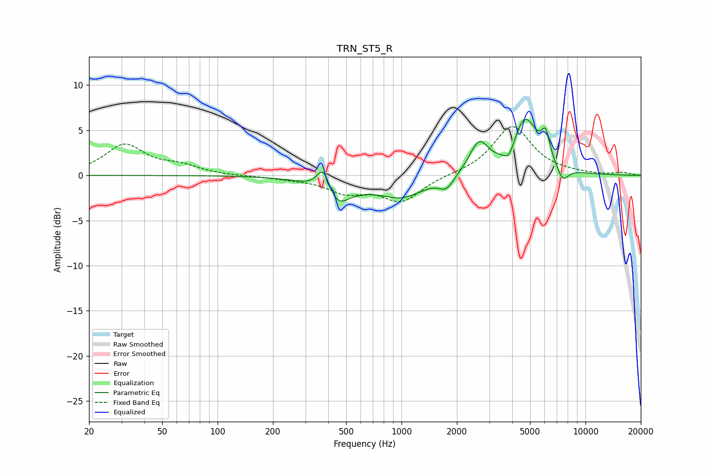

# TRN_ST5_R
See [usage instructions](https://github.com/jaakkopasanen/AutoEq#usage) for more options and info.

### Parametric EQs
Apply preamp of -6.3 dB when using parametric equalizer.

|   # | Type    |   Fc (Hz) |    Q |   Gain (dB) |
|-----|---------|-----------|------|-------------|
|   1 | Peaking |       376 | 3.83 |         3.2 |
|   2 | Peaking |       451 | 1.65 |        -3.8 |
|   3 | Peaking |       515 | 2.72 |         0.7 |
|   4 | Peaking |      1005 | 1.14 |        -2.2 |
|   5 | Peaking |      1756 | 3.6  |        -1.3 |
|   6 | Peaking |      2637 | 2.75 |         3.4 |
|   7 | Peaking |      3851 | 4.34 |        -1.7 |
|   8 | Peaking |      4683 | 1.97 |         6.3 |
|   9 | Peaking |      6079 | 5.99 |         2.8 |
|  10 | Peaking |      7535 | 4.31 |        -1.6 |

### Fixed Band EQs
When using fixed band (also called graphic) equalizer, apply preamp of **-5.5 dB** (if available) and set gains manually with these parameters.

|   # | Type    |   Fc (Hz) |    Q |   Gain (dB) |
|-----|---------|-----------|------|-------------|
|   1 | Peaking |        31 | 1.41 |         3.3 |
|   2 | Peaking |        62 | 1.41 |         0.9 |
|   3 | Peaking |       125 | 1.41 |        -0.1 |
|   4 | Peaking |       250 | 1.41 |        -0.3 |
|   5 | Peaking |       500 | 1.41 |        -1.7 |
|   6 | Peaking |      1000 | 1.41 |        -2.8 |
|   7 | Peaking |      2000 | 1.41 |         0.1 |
|   8 | Peaking |      4000 | 1.41 |         5.5 |
|   9 | Peaking |      8000 | 1.41 |         0.1 |
|  10 | Peaking |     16000 | 1.41 |         0.3 |

### Graphs

