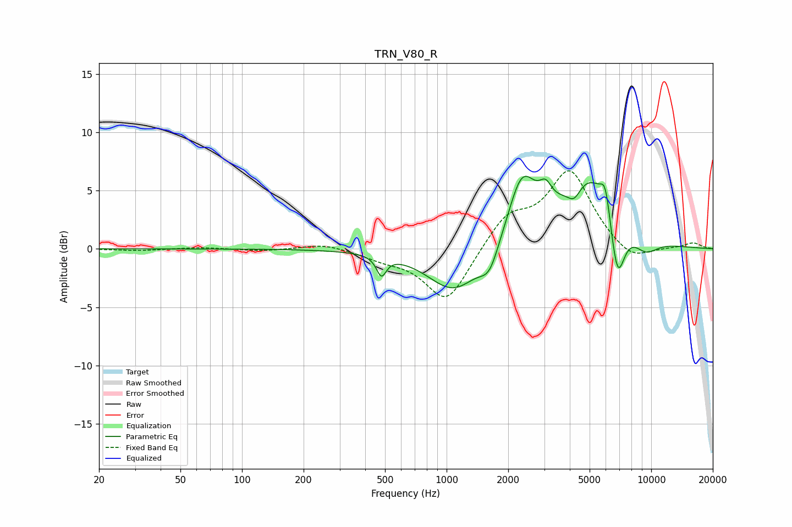

# TRN_V80_R
See [usage instructions](https://github.com/jaakkopasanen/AutoEq#usage) for more options and info.

### Parametric EQs
Apply preamp of -6.3 dB when using parametric equalizer.

|   # | Type    |   Fc (Hz) |    Q |   Gain (dB) |
|-----|---------|-----------|------|-------------|
|   1 | Peaking |       480 | 6    |        -1.7 |
|   2 | Peaking |      1090 | 1.09 |        -3.8 |
|   3 | Peaking |      1620 | 3.1  |        -2   |
|   4 | Peaking |      2334 | 2.03 |         5.6 |
|   5 | Peaking |      3046 | 4.56 |         1.6 |
|   6 | Peaking |      4202 | 4.35 |        -1.2 |
|   7 | Peaking |      5088 | 1.01 |         6.3 |
|   8 | Peaking |      5973 | 5.97 |         2.3 |
|   9 | Peaking |      6837 | 3.63 |        -5.8 |
|  10 | Peaking |      9355 | 1.97 |        -1.5 |

### Fixed Band EQs
When using fixed band (also called graphic) equalizer, apply preamp of **-6.8 dB** (if available) and set gains manually with these parameters.

|   # | Type    |   Fc (Hz) |    Q |   Gain (dB) |
|-----|---------|-----------|------|-------------|
|   1 | Peaking |        31 | 1.41 |        -0.2 |
|   2 | Peaking |        62 | 1.41 |         0.1 |
|   3 | Peaking |       125 | 1.41 |        -0.2 |
|   4 | Peaking |       250 | 1.41 |         0.5 |
|   5 | Peaking |       500 | 1.41 |        -0.7 |
|   6 | Peaking |      1000 | 1.41 |        -4.7 |
|   7 | Peaking |      2000 | 1.41 |         2.7 |
|   8 | Peaking |      4000 | 1.41 |         6.6 |
|   9 | Peaking |      8000 | 1.41 |        -1.3 |
|  10 | Peaking |     16000 | 1.41 |         0.5 |

### Graphs

