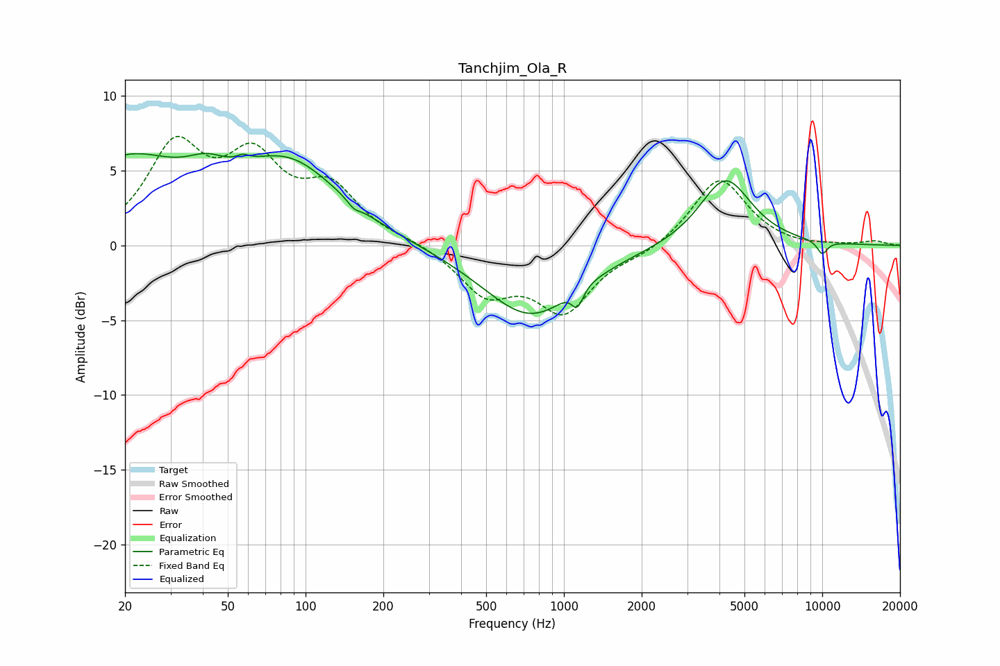

# Tanchjim_Ola_R
See [usage instructions](https://github.com/jaakkopasanen/AutoEq#usage) for more options and info.

### Parametric EQs
Apply preamp of -6.2 dB when using parametric equalizer.

|   # | Type    |   Fc (Hz) |    Q |   Gain (dB) |
|-----|---------|-----------|------|-------------|
|   1 | Peaking |        20 | 0.63 |         5.3 |
|   2 | Peaking |        41 | 1.86 |         1.2 |
|   3 | Peaking |        57 | 5.98 |         0.3 |
|   4 | Peaking |        86 | 0.7  |         5.1 |
|   5 | Peaking |       154 | 5.95 |        -0.4 |
|   6 | Peaking |       747 | 0.76 |        -4.8 |
|   7 | Peaking |      1111 | 3.14 |         0.7 |
|   8 | Peaking |      1127 | 5.8  |        -1.7 |
|   9 | Peaking |      4218 | 1.41 |         4.6 |
|  10 | Peaking |     10000 | 5.98 |        -0.9 |

### Fixed Band EQs
When using fixed band (also called graphic) equalizer, apply preamp of **-7.4 dB** (if available) and set gains manually with these parameters.

|   # | Type    |   Fc (Hz) |    Q |   Gain (dB) |
|-----|---------|-----------|------|-------------|
|   1 | Peaking |        31 | 1.41 |         6.2 |
|   2 | Peaking |        62 | 1.41 |         5.1 |
|   3 | Peaking |       125 | 1.41 |         3.4 |
|   4 | Peaking |       250 | 1.41 |         0.3 |
|   5 | Peaking |       500 | 1.41 |        -3   |
|   6 | Peaking |      1000 | 1.41 |        -4.2 |
|   7 | Peaking |      2000 | 1.41 |        -0.5 |
|   8 | Peaking |      4000 | 1.41 |         4.6 |
|   9 | Peaking |      8000 | 1.41 |        -0.1 |
|  10 | Peaking |     16000 | 1.41 |         0.3 |

### Graphs

