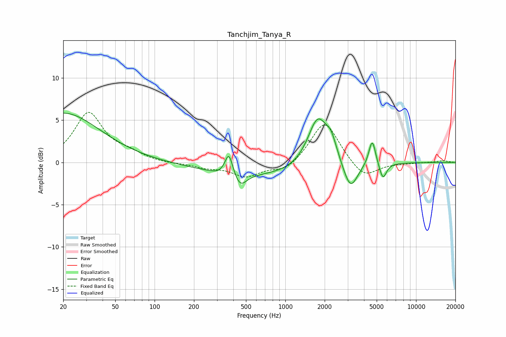

# Tanchjim_Tanya_R
See [usage instructions](https://github.com/jaakkopasanen/AutoEq#usage) for more options and info.

### Parametric EQs
Apply preamp of -5.9 dB when using parametric equalizer.

|   # | Type    |   Fc (Hz) |    Q |   Gain (dB) |
|-----|---------|-----------|------|-------------|
|   1 | Peaking |        20 | 0.5  |         5.8 |
|   2 | Peaking |       318 | 2.49 |        -0.3 |
|   3 | Peaking |       370 | 4.63 |         2.8 |
|   4 | Peaking |       450 | 2.95 |        -1.7 |
|   5 | Peaking |       660 | 0.31 |        -1.6 |
|   6 | Peaking |      1767 | 1.85 |         5.9 |
|   7 | Peaking |      2243 | 3.34 |         2   |
|   8 | Peaking |      3150 | 2.61 |        -3.3 |
|   9 | Peaking |      4622 | 5.43 |         3.1 |
|  10 | Peaking |      5577 | 5.11 |        -2   |

### Fixed Band EQs
When using fixed band (also called graphic) equalizer, apply preamp of **-6.0 dB** (if available) and set gains manually with these parameters.

|   # | Type    |   Fc (Hz) |    Q |   Gain (dB) |
|-----|---------|-----------|------|-------------|
|   1 | Peaking |        31 | 1.41 |         5.8 |
|   2 | Peaking |        62 | 1.41 |         0.9 |
|   3 | Peaking |       125 | 1.41 |        -0.2 |
|   4 | Peaking |       250 | 1.41 |        -0.5 |
|   5 | Peaking |       500 | 1.41 |        -1.6 |
|   6 | Peaking |      1000 | 1.41 |        -1.1 |
|   7 | Peaking |      2000 | 1.41 |         5   |
|   8 | Peaking |      4000 | 1.41 |        -2   |
|   9 | Peaking |      8000 | 1.41 |        -0.1 |
|  10 | Peaking |     16000 | 1.41 |         0.2 |

### Graphs

