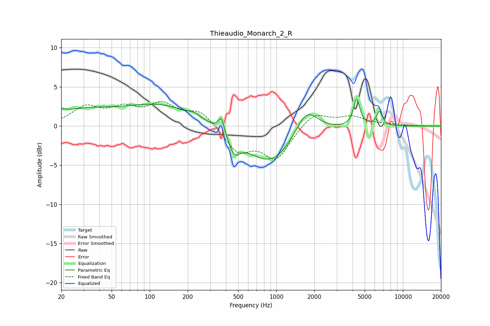

# Thieaudio_Monarch_2_R
See [usage instructions](https://github.com/jaakkopasanen/AutoEq#usage) for more options and info.

### Parametric EQs
Apply preamp of -3.5 dB when using parametric equalizer.

|   # | Type    |   Fc (Hz) |    Q |   Gain (dB) |
|-----|---------|-----------|------|-------------|
|   1 | Peaking |        20 | 3.96 |         0.5 |
|   2 | Peaking |        29 | 0.59 |         1.7 |
|   3 | Peaking |       122 | 0.49 |         2.6 |
|   4 | Peaking |       227 | 3.04 |         0.4 |
|   5 | Peaking |       368 | 5.97 |         2   |
|   6 | Peaking |       465 | 3.31 |        -2.2 |
|   7 | Peaking |       897 | 0.71 |        -4.9 |
|   8 | Peaking |      1731 | 1.56 |         3.7 |
|   9 | Peaking |      4312 | 5.58 |         3.5 |
|  10 | Peaking |      6534 | 6    |         1.8 |

### Fixed Band EQs
When using fixed band (also called graphic) equalizer, apply preamp of **-3.2 dB** (if available) and set gains manually with these parameters.

|   # | Type    |   Fc (Hz) |    Q |   Gain (dB) |
|-----|---------|-----------|------|-------------|
|   1 | Peaking |        31 | 1.41 |         2.2 |
|   2 | Peaking |        62 | 1.41 |         1.9 |
|   3 | Peaking |       125 | 1.41 |         2.5 |
|   4 | Peaking |       250 | 1.41 |         1.9 |
|   5 | Peaking |       500 | 1.41 |        -3.2 |
|   6 | Peaking |      1000 | 1.41 |        -4   |
|   7 | Peaking |      2000 | 1.41 |         1.9 |
|   8 | Peaking |      4000 | 1.41 |         1.1 |
|   9 | Peaking |      8000 | 1.41 |         0.1 |
|  10 | Peaking |     16000 | 1.41 |        -0   |

### Graphs

