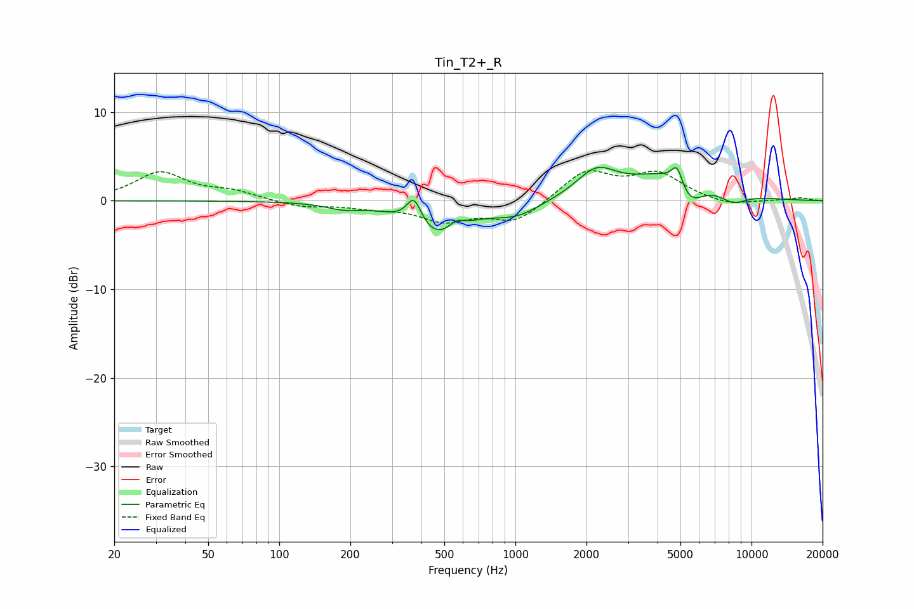

# Tin_T2+_R
See [usage instructions](https://github.com/jaakkopasanen/AutoEq#usage) for more options and info.

### Parametric EQs
Apply preamp of -3.9 dB when using parametric equalizer.

|   # | Type    |   Fc (Hz) |    Q |   Gain (dB) |
|-----|---------|-----------|------|-------------|
|   1 | Peaking |       187 | 1.98 |        -0.6 |
|   2 | Peaking |       372 | 4.44 |         3.1 |
|   3 | Peaking |       465 | 1.24 |        -4   |
|   4 | Peaking |       561 | 4.28 |         1   |
|   5 | Peaking |      1011 | 1.39 |        -1.6 |
|   6 | Peaking |      2202 | 1.68 |         3.1 |
|   7 | Peaking |      4762 | 0.86 |         3.8 |
|   8 | Peaking |      4838 | 6    |         2.3 |
|   9 | Peaking |      5462 | 2.19 |        -3.5 |
|  10 | Peaking |      8348 | 2.28 |        -1.3 |

### Fixed Band EQs
When using fixed band (also called graphic) equalizer, apply preamp of **-3.5 dB** (if available) and set gains manually with these parameters.

|   # | Type    |   Fc (Hz) |    Q |   Gain (dB) |
|-----|---------|-----------|------|-------------|
|   1 | Peaking |        31 | 1.41 |         3.1 |
|   2 | Peaking |        62 | 1.41 |         0.9 |
|   3 | Peaking |       125 | 1.41 |        -0.7 |
|   4 | Peaking |       250 | 1.41 |        -0.6 |
|   5 | Peaking |       500 | 1.41 |        -2.1 |
|   6 | Peaking |      1000 | 1.41 |        -2.4 |
|   7 | Peaking |      2000 | 1.41 |         3.4 |
|   8 | Peaking |      4000 | 1.41 |         2.9 |
|   9 | Peaking |      8000 | 1.41 |        -0.6 |
|  10 | Peaking |     16000 | 1.41 |         0.3 |

### Graphs

