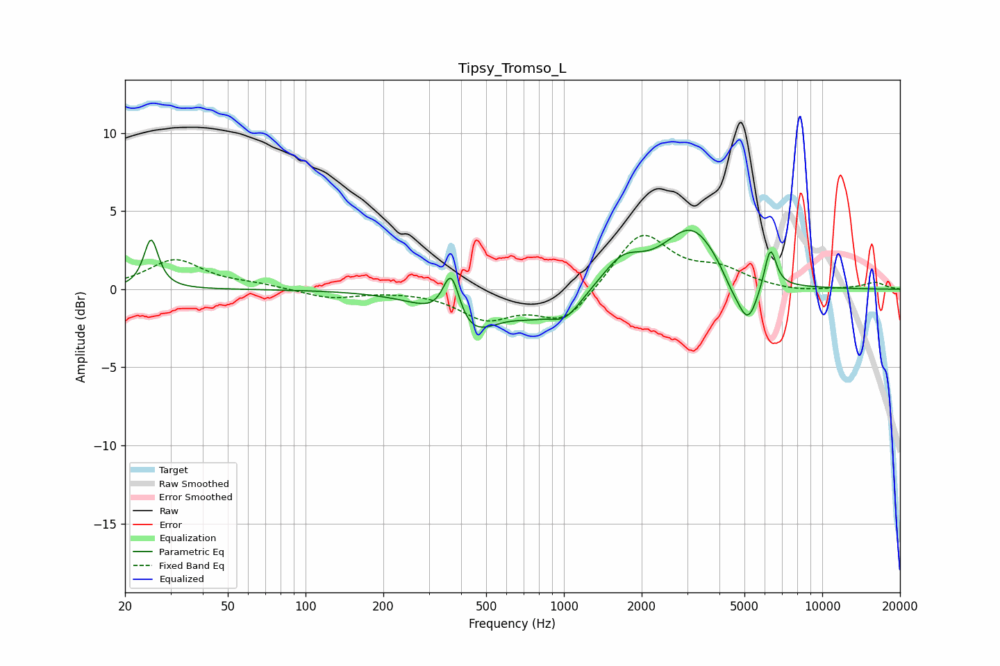

# Tipsy_Tromso_L
See [usage instructions](https://github.com/jaakkopasanen/AutoEq#usage) for more options and info.

### Parametric EQs
Apply preamp of -3.9 dB when using parametric equalizer.

|   # | Type    |   Fc (Hz) |    Q |   Gain (dB) |
|-----|---------|-----------|------|-------------|
|   1 | Peaking |        25 | 5.24 |         3.2 |
|   2 | Peaking |       366 | 4.21 |         3.4 |
|   3 | Peaking |       423 | 1.24 |        -3   |
|   4 | Peaking |       743 | 1.72 |        -0.8 |
|   5 | Peaking |      1012 | 2.13 |        -1.6 |
|   6 | Peaking |      1691 | 1.86 |         1.7 |
|   7 | Peaking |      3129 | 1.3  |         3.9 |
|   8 | Peaking |      4430 | 3.4  |        -0.8 |
|   9 | Peaking |      5149 | 3.35 |        -2.9 |
|  10 | Peaking |      6295 | 6    |         2.7 |

### Fixed Band EQs
When using fixed band (also called graphic) equalizer, apply preamp of **-3.5 dB** (if available) and set gains manually with these parameters.

|   # | Type    |   Fc (Hz) |    Q |   Gain (dB) |
|-----|---------|-----------|------|-------------|
|   1 | Peaking |        31 | 1.41 |         1.9 |
|   2 | Peaking |        62 | 1.41 |         0.3 |
|   3 | Peaking |       125 | 1.41 |        -0.6 |
|   4 | Peaking |       250 | 1.41 |        -0   |
|   5 | Peaking |       500 | 1.41 |        -1.8 |
|   6 | Peaking |      1000 | 1.41 |        -2.1 |
|   7 | Peaking |      2000 | 1.41 |         3.7 |
|   8 | Peaking |      4000 | 1.41 |         1.1 |
|   9 | Peaking |      8000 | 1.41 |        -0.2 |
|  10 | Peaking |     16000 | 1.41 |         0.4 |

### Graphs

