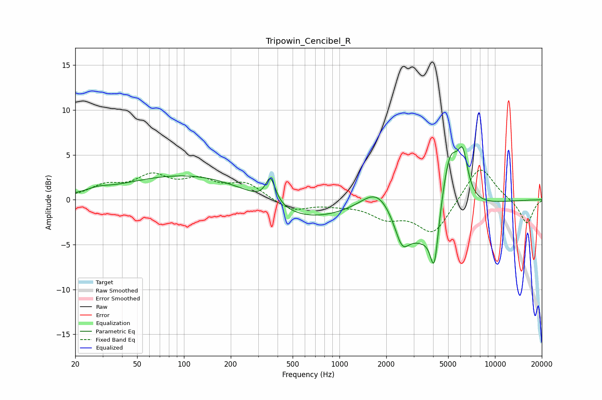

# Tripowin_Cencibel_R
See [usage instructions](https://github.com/jaakkopasanen/AutoEq#usage) for more options and info.

### Parametric EQs
Apply preamp of -6.0 dB when using parametric equalizer.

|   # | Type    |   Fc (Hz) |    Q |   Gain (dB) |
|-----|---------|-----------|------|-------------|
|   1 | Peaking |        28 | 2.18 |         0.4 |
|   2 | Peaking |       122 | 0.31 |         3   |
|   3 | Peaking |       360 | 4.57 |         2.8 |
|   4 | Peaking |       552 | 0.51 |        -2.7 |
|   5 | Peaking |      1763 | 1.35 |         3   |
|   6 | Peaking |      2524 | 3.06 |        -3   |
|   7 | Peaking |      3847 | 0.88 |        -6.4 |
|   8 | Peaking |      4073 | 5.64 |        -5.3 |
|   9 | Peaking |      5116 | 2.09 |         9.2 |
|  10 | Peaking |      6212 | 4.3  |         4.3 |

### Fixed Band EQs
When using fixed band (also called graphic) equalizer, apply preamp of **-3.4 dB** (if available) and set gains manually with these parameters.

|   # | Type    |   Fc (Hz) |    Q |   Gain (dB) |
|-----|---------|-----------|------|-------------|
|   1 | Peaking |        31 | 1.41 |         1.4 |
|   2 | Peaking |        62 | 1.41 |         2.3 |
|   3 | Peaking |       125 | 1.41 |         1.8 |
|   4 | Peaking |       250 | 1.41 |         1.7 |
|   5 | Peaking |       500 | 1.41 |        -1.3 |
|   6 | Peaking |      1000 | 1.41 |        -0.4 |
|   7 | Peaking |      2000 | 1.41 |        -1.7 |
|   8 | Peaking |      4000 | 1.41 |        -3.8 |
|   9 | Peaking |      8000 | 1.41 |         4   |
|  10 | Peaking |     16000 | 1.41 |        -2.7 |

### Graphs

